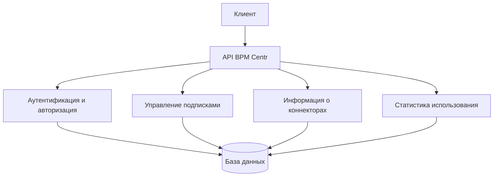

# Обзор API платформы BPM Centr

В этом документе представлен обзор API платформы "BPM Centr", которое обеспечивает программный доступ к функциональности платформы, включая управление подписками и доступ к коннекторам.

## Назначение API

API платформы "BPM Centr" предназначено для:

1. **Проверки статуса подписки** - коннекторы используют API для проверки активности подписки пользователя
2. **Управления подписками** - пользователи могут программно управлять своими подписками
3. **Получения информации о коннекторах** - получение списка доступных коннекторов и их возможностей
4. **Сбора статистики использования** - регистрация использования коннекторов для биллинга и аналитики

## Архитектура API

### Общая архитектура

API платформы "BPM Centr" построено на принципах REST и предоставляет доступ к ресурсам платформы через стандартные HTTP-методы.



### Компоненты API

1. **Аутентификация и авторизация** - обеспечивает безопасный доступ к API
2. **Управление подписками** - предоставляет функциональность для управления подписками
3. **Информация о коннекторах** - предоставляет информацию о доступных коннекторах
4. **Статистика использования** - собирает и предоставляет статистику использования коннекторов

## Аутентификация и авторизация

### Методы аутентификации

API платформы "BPM Centr" поддерживает следующие методы аутентификации:

1. **API-ключи** - основной метод аутентификации для коннекторов и интеграций
2. **OAuth 2.0** - для интеграции с внешними приложениями
3. **JWT-токены** - для аутентификации пользователей

### Процесс аутентификации с использованием API-ключа

1. Пользователь получает API-ключ в личном кабинете BPM Centr
2. API-ключ передается в заголовке `Authorization` в формате `Bearer {api_key}`
3. API проверяет валидность ключа и права доступа
4. При успешной аутентификации API выполняет запрос

### Права доступа

API платформы "BPM Centr" использует ролевую модель доступа:

1. **user** - базовые права для пользователей
2. **admin** - расширенные права для администраторов
3. **connector** - специальные права для коннекторов

## Основные эндпоинты API

### Проверка подписки

```
GET /subscription/check
```

Этот эндпоинт используется коннекторами для проверки статуса подписки пользователя.

**Параметры запроса**:
- `connector` - имя коннектора
- `accountId` - идентификатор аккаунта Make

**Заголовки**:
- `Authorization: Bearer {api_key}` - API-ключ пользователя

**Пример ответа**:
```json
{
  "active": true,
  "hasAccess": true,
  "accountId": "make_account_123",
  "category": "Стандартный",
  "expires_at": "2023-12-31T23:59:59Z"
}
```

### Информация о подписке

```
GET /subscription/info
```

Этот эндпоинт предоставляет детальную информацию о подписке пользователя.

**Заголовки**:
- `Authorization: Bearer {api_key}` - API-ключ пользователя

**Пример ответа**:
```json
{
  "user_id": "user123",
  "email": "user@example.com",
  "active": true,
  "created_at": "2023-01-01T00:00:00Z",
  "expires_at": "2023-12-31T23:59:59Z",
  "auto_renew": true,
  "subscriptions": [
    {
      "id": "sub_1",
      "connector": "creatio",
      "category": "Стандартный",
      "make_account_id": "make_account_1",
      "active": true,
      "expires_at": "2023-12-31T23:59:59Z"
    },
    {
      "id": "sub_2",
      "connector": "kommocrm",
      "category": "Расширенный",
      "make_account_id": "make_account_1",
      "active": true,
      "expires_at": "2023-12-31T23:59:59Z"
    },
    {
      "id": "sub_3",
      "connector": "keycrm",
      "category": "Стандартный",
      "make_account_id": "make_account_2",
      "active": true,
      "expires_at": "2023-12-31T23:59:59Z"
    }
  ]
}
```

### Регистрация использования

```
POST /subscription/usage
```

Этот эндпоинт используется для регистрации использования коннекторов.

**Заголовки**:
- `Authorization: Bearer {api_key}` - API-ключ пользователя
- `Content-Type: application/json`

**Тело запроса**:
```json
{
  "connector": "creatio",
  "operation": "getContact",
  "make_account_id": "make_account_1",
  "count": 1
}
```

**Пример ответа**:
```json
{
  "success": true,
  "usage": {
    "operations_count": 2501
  }
}
```

### Список коннекторов

```
GET /connectors
```

Этот эндпоинт предоставляет список доступных коннекторов.

**Заголовки**:
- `Authorization: Bearer {api_key}` - API-ключ пользователя

**Параметры запроса**:
- `type` (опционально) - тип коннектора (crm, marketplace, payment)
- `page` (опционально) - номер страницы
- `limit` (опционально) - количество элементов на странице

**Пример ответа**:
```json
{
  "items": [
    {
      "name": "creatio",
      "label": "Creatio CRM",
      "description": "Connector for Creatio CRM",
      "type": "crm",
      "version": "1.0.0",
      "icon_url": "https://api.bpmcentr.ru/icons/creatio.png"
    },
    {
      "name": "kommocrm",
      "label": "KommoCRM",
      "description": "Connector for KommoCRM",
      "type": "crm",
      "version": "1.0.0",
      "icon_url": "https://api.bpmcentr.ru/icons/kommocrm.png"
    }
  ],
  "total": 10,
  "page": 1,
  "limit": 10
}
```

### Информация о коннекторе

```
GET /connectors/{connector_name}
```

Этот эндпоинт предоставляет детальную информацию о конкретном коннекторе.

**Заголовки**:
- `Authorization: Bearer {api_key}` - API-ключ пользователя

**Пример ответа**:
```json
{
  "name": "creatio",
  "label": "Creatio CRM",
  "description": "Connector for Creatio CRM",
  "type": "crm",
  "version": "1.0.0",
  "icon_url": "https://api.bpmcentr.ru/icons/creatio.png",
  "modules": [
    {
      "name": "contacts",
      "label": "Contacts",
      "operations": [
        {
          "name": "getContact",
          "label": "Get Contact"
        },
        {
          "name": "createContact",
          "label": "Create Contact"
        }
      ],
      "triggers": [
        {
          "name": "newContact",
          "label": "New Contact"
        }
      ]
    }
  ]
}
```

## Использование API в коннекторах

### Проверка подписки в коннекторе

Коннекторы используют API платформы "BPM Centr" для проверки статуса подписки пользователя перед выполнением операций.

```javascript
async function checkSubscription(bpmCentrApiKey, connectorName, makeAccountId, context) {
  try {
    // Запрос к API BPM Centr для проверки подписки
    const response = await context.http.get({
      url: 'https://api.bpmcentr.ru/v1/subscription/check',
      headers: {
        'Authorization': `Bearer ${bpmCentrApiKey}`
      },
      params: {
        connector: connectorName,
        accountId: makeAccountId
      }
    });

    // Проверка результата
    if (response.statusCode !== 200) {
      throw new Error(`Subscription check failed: ${response.body.message || 'Unknown error'}`);
    }

    if (!response.body.active) {
      throw new Error('Your subscription is inactive or expired. Please renew your subscription at BPM Centr.');
    }

    if (!response.body.hasAccess) {
      throw new Error('This connector is not available for your subscription. Please purchase access to this connector at BPM Centr.');
    }

    if (response.body.accountId !== makeAccountId) {
      throw new Error('This connector is linked to a different Make account. Please purchase a subscription for this account at BPM Centr.');
    }

    return true;
  } catch (error) {
    throw new Error(`Subscription check failed: ${error.message}`);
  }
}
```

### Регистрация использования в коннекторе

Коннекторы могут регистрировать использование операций для биллинга и аналитики.

```javascript
async function registerUsage(bpmCentrApiKey, connectorName, operationName, makeAccountId, context) {
  try {
    // Запрос к API BPM Centr для регистрации использования
    const response = await context.http.post({
      url: 'https://api.bpmcentr.ru/v1/subscription/usage',
      headers: {
        'Authorization': `Bearer ${bpmCentrApiKey}`,
        'Content-Type': 'application/json'
      },
      body: {
        connector: connectorName,
        operation: operationName,
        make_account_id: makeAccountId,
        count: 1
      }
    });

    // Проверка результата
    if (response.statusCode !== 200 || !response.body.success) {
      console.warn(`Failed to register usage: ${response.body.error || 'Unknown error'}`);
    }
  } catch (error) {
    console.warn(`Error registering usage: ${error.message}`);
  }
}
```

## Рекомендации по использованию API

### Общие рекомендации

1. **Используйте HTTPS** - всегда используйте HTTPS для запросов к API
2. **Обрабатывайте ошибки** - корректно обрабатывайте ошибки API
3. **Используйте повторные попытки** - реализуйте механизм повторных попыток для временных ошибок
4. **Кэшируйте результаты** - кэшируйте результаты запросов, где это возможно

### Рекомендации по безопасности

1. **Защищайте API-ключи** - не передавайте API-ключи в открытом виде
2. **Используйте минимальные права** - запрашивайте только необходимые права доступа
3. **Регулярно обновляйте ключи** - периодически обновляйте API-ключи
4. **Мониторьте использование** - отслеживайте использование API-ключей

### Рекомендации по производительности

1. **Минимизируйте количество запросов** - объединяйте запросы, где это возможно
2. **Используйте пагинацию** - используйте пагинацию для больших наборов данных
3. **Оптимизируйте запросы** - запрашивайте только необходимые данные
4. **Кэшируйте токены** - кэшируйте токены аутентификации

## Ограничения API

### Лимиты запросов

API платформы "BPM Centr" имеет следующие лимиты запросов:

1. **Стандартные коннекторы** - 100 запросов в минуту
2. **Расширенные коннекторы** - 300 запросов в минуту
3. **Премиум коннекторы** - 1000 запросов в минуту
4. **Корпоративные решения** - индивидуальные лимиты

### Обработка превышения лимитов

При превышении лимитов API возвращает ответ с кодом 429 (Too Many Requests) и заголовком `Retry-After`, указывающим время в секундах, через которое можно повторить запрос.

### Размер данных

Максимальный размер запроса - 10 МБ
Максимальный размер ответа - 100 МБ

## Версионирование API

API платформы "BPM Centr" использует семантическое версионирование:

1. **Major версия** - несовместимые изменения API
2. **Minor версия** - новая функциональность с обратной совместимостью
3. **Patch версия** - исправления ошибок

Версия API указывается в URL:
```
https://api.bpmcentr.ru/v1/subscription/check
```

## Связанные разделы

- [API Endpoints](endpoints.md)
- [Аутентификация в API](authentication.md)
- [Управление подписками](../subscription/overview.md)
- [Разработка коннекторов](../connectors/development.md)
