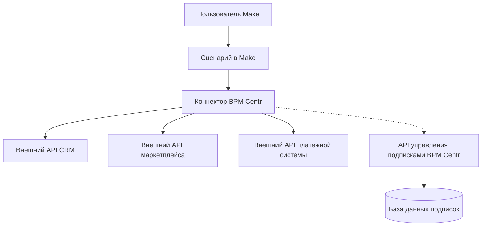

# Обзор коннекторов BPM Centr

## Что такое коннекторы BPM Centr

Коннекторы BPM Centr - это специализированные модули для платформы Make (ранее Integromat), которые обеспечивают интеграцию с различными внешними сервисами и системами, не представленными в официальном маркетплейсе Make. Эти коннекторы позволяют пользователям Make автоматизировать бизнес-процессы, связанные с CRM-системами, маркетплейсами, платежными сервисами и другими специализированными системами.

## Ключевые особенности коннекторов

1. **Уникальность** - коннекторы BPM Centr разрабатываются для систем, которые не представлены в официальном маркетплейсе Make
2. **Прямое взаимодействие** - данные передаются напрямую между Make и целевыми системами, без прохождения через серверы BPM Centr
3. **Контроль доступа** - доступ к коннекторам контролируется через систему подписок BPM Centr
4. **Высокое качество** - коннекторы разрабатываются с учетом лучших практик и проходят тщательное тестирование

## Архитектура коннекторов

### Общая архитектура

BPM Centr выступает в роли разработчика коннекторов для платформы Make, которые отсутствуют в официальном маркетплейсе. Коннекторы обеспечивают прямую интеграцию между платформой Make и различными внешними сервисами без прохождения данных через серверы BPM Centr.

Архитектура коннекторов состоит из следующих компонентов:

1. **Модуль коннектора в Make** - компонент, который определяет интерфейс взаимодействия с Make и напрямую взаимодействует с API внешних сервисов
2. **Система управления подписками BPM Centr** - контролирует доступ к коннекторам на основе подписок пользователей
3. **Механизм проверки подписки** - компонент коннектора, который проверяет статус подписки пользователя через API BPM Centr

### Диаграмма архитектуры

## Типы коннекторов

В рамках проекта "BPM Centr" разрабатываются следующие типы коннекторов:

1. **CRM-коннекторы** - интеграция с CRM-системами (Creatio, KommoCRM, KeyCRM и др.)
2. **Маркетплейс-коннекторы** - интеграция с маркетплейсами (Rozetka, Prom.ua, Allo и др.)
3. **Платежные коннекторы** - интеграция с платежными системами (WayForPay, Fondy, LiqPay и др.)
4. **ERP-коннекторы** - интеграция с ERP-системами (1C, SAP, Microsoft Dynamics и др.)
5. **Специализированные коннекторы** - интеграция с другими специфическими сервисами

## Преимущества использования коннекторов BPM Centr

1. **Расширение возможностей Make** - доступ к интеграциям с системами, не представленными в официальном маркетплейсе
2. **Безопасность данных** - данные передаются напрямую между Make и целевыми системами
3. **Профессиональная разработка** - коннекторы разрабатываются опытными специалистами
4. **Регулярные обновления** - постоянное улучшение и добавление новых функций
5. **Техническая поддержка** - помощь в настройке и использовании коннекторов

## Процесс использования коннекторов

1. **Регистрация в BPM Centr** - создание учетной записи на платформе
2. **Выбор коннекторов** - подписка на необходимые коннекторы
3. **Получение API-ключа** - генерация ключа для доступа к коннекторам
4. **Настройка коннектора в Make** - добавление коннектора в сценарий и настройка параметров
5. **Использование коннектора** - создание автоматизаций с использованием коннектора

## Связанные разделы

- [Структура коннекторов](structure.md)
- [Разработка коннекторов](development.md)
- [Тестирование коннекторов](testing.md)
- [Примеры коннекторов](examples/)
- [Управление подписками](../subscription/overview.md)
