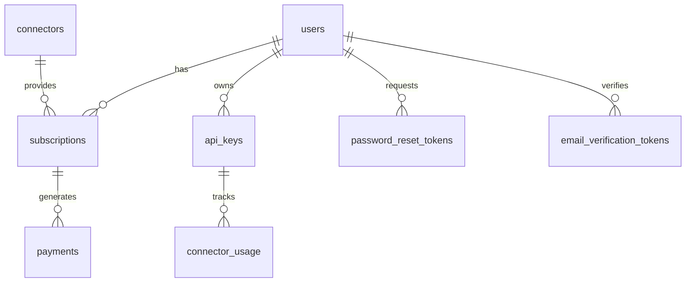

# Схема базы данных BPM Centr

В этом документе описывается схема базы данных платформы "BPM Centr" для MVP.

## Обзор схемы базы данных

База данных BPM Centr построена на PostgreSQL и содержит следующие основные таблицы:

1. **users** - Пользователи системы
2. **subscriptions** - Подписки пользователей
3. **connectors** - Коннекторы и их категории
4. **api_keys** - API-ключи пользователей
5. **connector_usage** - Использование коннекторов
6. **payments** - Платежи за подписки
7. **password_reset_tokens** - Токены для сброса пароля
8. **email_verification_tokens** - Токены для подтверждения email

## Диаграмма связей



## Детальное описание таблиц

### Таблица `users`

Хранит информацию о пользователях системы.

| Поле | Тип | Описание | Ограничения |
|------|-----|----------|-------------|
| id | UUID | Уникальный идентификатор пользователя | PRIMARY KEY |
| email | VARCHAR(255) | Email пользователя | UNIQUE, NOT NULL |
| password_hash | VARCHAR(255) | Хеш пароля | NOT NULL |
| first_name | VARCHAR(100) | Имя пользователя | NOT NULL |
| last_name | VARCHAR(100) | Фамилия пользователя | NOT NULL |
| company | VARCHAR(255) | Название компании | NULL |
| status | ENUM | Статус пользователя (unverified, active, suspended, deleted) | NOT NULL, DEFAULT 'unverified' |
| created_at | TIMESTAMP | Дата и время создания | NOT NULL, DEFAULT NOW() |
| updated_at | TIMESTAMP | Дата и время обновления | NOT NULL, DEFAULT NOW() |

```sql
CREATE TABLE users (
    id UUID PRIMARY KEY DEFAULT gen_random_uuid(),
    email VARCHAR(255) UNIQUE NOT NULL,
    password_hash VARCHAR(255) NOT NULL,
    first_name VARCHAR(100) NOT NULL,
    last_name VARCHAR(100) NOT NULL,
    company VARCHAR(255),
    status VARCHAR(20) NOT NULL DEFAULT 'unverified',
    created_at TIMESTAMP NOT NULL DEFAULT NOW(),
    updated_at TIMESTAMP NOT NULL DEFAULT NOW(),
    CONSTRAINT status_check CHECK (status IN ('unverified', 'active', 'suspended', 'deleted'))
);

CREATE INDEX idx_users_email ON users(email);
CREATE INDEX idx_users_status ON users(status);
```

### Таблица `connectors`

Хранит информацию о доступных коннекторах.

| Поле | Тип | Описание | Ограничения |
|------|-----|----------|-------------|
| id | VARCHAR(50) | Уникальный идентификатор коннектора | PRIMARY KEY |
| name | VARCHAR(100) | Название коннектора | NOT NULL |
| description | TEXT | Описание коннектора | NULL |
| category | VARCHAR(50) | Категория коннектора (Стандартный, Расширенный, Премиум) | NOT NULL |
| price | DECIMAL(10,2) | Стоимость коннектора | NOT NULL |
| currency | VARCHAR(3) | Валюта (USD) | NOT NULL, DEFAULT 'USD' |
| interval | VARCHAR(20) | Интервал оплаты (month, year) | NOT NULL |
| trial_period_days | INTEGER | Количество дней пробного периода | NOT NULL, DEFAULT 7 |
| features | JSONB | Дополнительные возможности коннектора | NULL |
| is_active | BOOLEAN | Активен ли коннектор | NOT NULL, DEFAULT TRUE |
| created_at | TIMESTAMP | Дата и время создания | NOT NULL, DEFAULT NOW() |
| updated_at | TIMESTAMP | Дата и время обновления | NOT NULL, DEFAULT NOW() |

```sql
CREATE TABLE connectors (
    id VARCHAR(50) PRIMARY KEY,
    name VARCHAR(100) NOT NULL,
    description TEXT,
    category VARCHAR(50) NOT NULL,
    price DECIMAL(10,2) NOT NULL,
    currency VARCHAR(3) NOT NULL DEFAULT 'USD',
    interval VARCHAR(20) NOT NULL,
    trial_period_days INTEGER NOT NULL DEFAULT 7,
    features JSONB,
    is_active BOOLEAN NOT NULL DEFAULT TRUE,
    created_at TIMESTAMP NOT NULL DEFAULT NOW(),
    updated_at TIMESTAMP NOT NULL DEFAULT NOW(),
    CONSTRAINT interval_check CHECK (interval IN ('month', 'year')),
    CONSTRAINT category_check CHECK (category IN ('Стандартный', 'Расширенный', 'Премиум'))
);

CREATE INDEX idx_connectors_category ON connectors(category);
CREATE INDEX idx_connectors_is_active ON connectors(is_active);
```

### Таблица `subscriptions`

Хранит информацию о подписках пользователей на коннекторы.

| Поле | Тип | Описание | Ограничения |
|------|-----|----------|-------------|
| id | UUID | Уникальный идентификатор подписки | PRIMARY KEY |
| user_id | UUID | Идентификатор пользователя | FOREIGN KEY (users.id) |
| connector_id | VARCHAR(50) | Идентификатор коннектора | FOREIGN KEY (connectors.id) |
| make_account_id | VARCHAR(100) | Идентификатор аккаунта Make | NOT NULL |
| status | ENUM | Статус подписки (trial, active, payment_pending, suspended, canceled, expired) | NOT NULL |
| start_date | TIMESTAMP | Дата начала подписки | NOT NULL |
| end_date | TIMESTAMP | Дата окончания подписки | NOT NULL |
| trial_end_date | TIMESTAMP | Дата окончания пробного периода | NULL |
| auto_renew | BOOLEAN | Автоматическое продление | NOT NULL, DEFAULT TRUE |
| stripe_subscription_id | VARCHAR(255) | ID подписки в Stripe | NULL |
| canceled_at | TIMESTAMP | Дата отмены подписки | NULL |
| created_at | TIMESTAMP | Дата и время создания | NOT NULL, DEFAULT NOW() |
| updated_at | TIMESTAMP | Дата и время обновления | NOT NULL, DEFAULT NOW() |

```sql
CREATE TABLE subscriptions (
    id UUID PRIMARY KEY DEFAULT gen_random_uuid(),
    user_id UUID NOT NULL REFERENCES users(id) ON DELETE CASCADE,
    connector_id VARCHAR(50) NOT NULL REFERENCES connectors(id),
    make_account_id VARCHAR(100) NOT NULL,
    status VARCHAR(20) NOT NULL,
    start_date TIMESTAMP NOT NULL,
    end_date TIMESTAMP NOT NULL,
    trial_end_date TIMESTAMP,
    auto_renew BOOLEAN NOT NULL DEFAULT TRUE,
    stripe_subscription_id VARCHAR(255),
    canceled_at TIMESTAMP,
    created_at TIMESTAMP NOT NULL DEFAULT NOW(),
    updated_at TIMESTAMP NOT NULL DEFAULT NOW(),
    CONSTRAINT status_check CHECK (status IN ('trial', 'active', 'payment_pending', 'suspended', 'canceled', 'expired')),
    CONSTRAINT date_check CHECK (end_date > start_date),
    CONSTRAINT unique_connector_account UNIQUE (connector_id, make_account_id)
);

CREATE INDEX idx_subscriptions_user_id ON subscriptions(user_id);
CREATE INDEX idx_subscriptions_connector_id ON subscriptions(connector_id);
CREATE INDEX idx_subscriptions_make_account_id ON subscriptions(make_account_id);
CREATE INDEX idx_subscriptions_status ON subscriptions(status);
CREATE INDEX idx_subscriptions_end_date ON subscriptions(end_date);
```

### Таблица `api_keys`

Хранит информацию об API-ключах пользователей.

| Поле | Тип | Описание | Ограничения |
|------|-----|----------|-------------|
| id | UUID | Уникальный идентификатор API-ключа | PRIMARY KEY |
| user_id | UUID | Идентификатор пользователя | FOREIGN KEY (users.id) |
| name | VARCHAR(100) | Название API-ключа | NOT NULL |
| key_hash | VARCHAR(255) | Хеш API-ключа | NOT NULL |
| prefix | VARCHAR(20) | Префикс API-ключа | NOT NULL |
| is_active | BOOLEAN | Активен ли ключ | NOT NULL, DEFAULT TRUE |
| last_used_at | TIMESTAMP | Дата и время последнего использования | NULL |
| created_at | TIMESTAMP | Дата и время создания | NOT NULL, DEFAULT NOW() |
| updated_at | TIMESTAMP | Дата и время обновления | NOT NULL, DEFAULT NOW() |

```sql
CREATE TABLE api_keys (
    id UUID PRIMARY KEY DEFAULT gen_random_uuid(),
    user_id UUID NOT NULL REFERENCES users(id) ON DELETE CASCADE,
    name VARCHAR(100) NOT NULL,
    key_hash VARCHAR(255) NOT NULL,
    prefix VARCHAR(20) NOT NULL,
    is_active BOOLEAN NOT NULL DEFAULT TRUE,
    last_used_at TIMESTAMP,
    created_at TIMESTAMP NOT NULL DEFAULT NOW(),
    updated_at TIMESTAMP NOT NULL DEFAULT NOW()
);

CREATE INDEX idx_api_keys_user_id ON api_keys(user_id);
CREATE INDEX idx_api_keys_prefix ON api_keys(prefix);
CREATE INDEX idx_api_keys_is_active ON api_keys(is_active);
```

### Таблица `connector_usage`

Хранит информацию об использовании коннекторов.

| Поле | Тип | Описание | Ограничения |
|------|-----|----------|-------------|
| id | UUID | Уникальный идентификатор записи | PRIMARY KEY |
| api_key_id | UUID | Идентификатор API-ключа | FOREIGN KEY (api_keys.id) |
| connector_id | VARCHAR(50) | Идентификатор коннектора | FOREIGN KEY (connectors.id) |
| make_account_id | VARCHAR(100) | Идентификатор аккаунта Make | NOT NULL |
| operation | VARCHAR(100) | Название операции | NOT NULL |
| timestamp | TIMESTAMP | Дата и время операции | NOT NULL |
| status | VARCHAR(20) | Статус операции (success, error) | NOT NULL |
| error_message | TEXT | Сообщение об ошибке | NULL |
| created_at | TIMESTAMP | Дата и время создания | NOT NULL, DEFAULT NOW() |

```sql
CREATE TABLE connector_usage (
    id UUID PRIMARY KEY DEFAULT gen_random_uuid(),
    api_key_id UUID NOT NULL REFERENCES api_keys(id) ON DELETE CASCADE,
    connector_id VARCHAR(50) NOT NULL REFERENCES connectors(id),
    make_account_id VARCHAR(100) NOT NULL,
    operation VARCHAR(100) NOT NULL,
    timestamp TIMESTAMP NOT NULL,
    status VARCHAR(20) NOT NULL,
    error_message TEXT,
    created_at TIMESTAMP NOT NULL DEFAULT NOW(),
    CONSTRAINT status_check CHECK (status IN ('success', 'error'))
);

CREATE INDEX idx_connector_usage_api_key_id ON connector_usage(api_key_id);
CREATE INDEX idx_connector_usage_connector_id ON connector_usage(connector_id);
CREATE INDEX idx_connector_usage_make_account_id ON connector_usage(make_account_id);
CREATE INDEX idx_connector_usage_timestamp ON connector_usage(timestamp);
```

### Таблица `payments`

Хранит информацию о платежах за подписки.

| Поле | Тип | Описание | Ограничения |
|------|-----|----------|-------------|
| id | UUID | Уникальный идентификатор платежа | PRIMARY KEY |
| subscription_id | UUID | Идентификатор подписки | FOREIGN KEY (subscriptions.id) |
| amount | DECIMAL(10,2) | Сумма платежа | NOT NULL |
| currency | VARCHAR(3) | Валюта платежа | NOT NULL |
| status | ENUM | Статус платежа (pending, completed, failed, refunded) | NOT NULL |
| payment_method | VARCHAR(50) | Способ оплаты | NOT NULL |
| payment_provider | VARCHAR(50) | Платежная система | NOT NULL |
| provider_payment_id | VARCHAR(255) | ID платежа в платежной системе | NULL |
| payment_date | TIMESTAMP | Дата и время платежа | NULL |
| created_at | TIMESTAMP | Дата и время создания | NOT NULL, DEFAULT NOW() |
| updated_at | TIMESTAMP | Дата и время обновления | NOT NULL, DEFAULT NOW() |

```sql
CREATE TABLE payments (
    id UUID PRIMARY KEY DEFAULT gen_random_uuid(),
    subscription_id UUID NOT NULL REFERENCES subscriptions(id) ON DELETE CASCADE,
    amount DECIMAL(10,2) NOT NULL,
    currency VARCHAR(3) NOT NULL,
    status VARCHAR(20) NOT NULL,
    payment_method VARCHAR(50) NOT NULL,
    payment_provider VARCHAR(50) NOT NULL,
    provider_payment_id VARCHAR(255),
    payment_date TIMESTAMP,
    created_at TIMESTAMP NOT NULL DEFAULT NOW(),
    updated_at TIMESTAMP NOT NULL DEFAULT NOW(),
    CONSTRAINT status_check CHECK (status IN ('pending', 'completed', 'failed', 'refunded'))
);

CREATE INDEX idx_payments_subscription_id ON payments(subscription_id);
CREATE INDEX idx_payments_status ON payments(status);
CREATE INDEX idx_payments_payment_date ON payments(payment_date);
```

### Таблица `password_reset_tokens`

Хранит токены для сброса пароля.

| Поле | Тип | Описание | Ограничения |
|------|-----|----------|-------------|
| id | UUID | Уникальный идентификатор токена | PRIMARY KEY |
| user_id | UUID | Идентификатор пользователя | FOREIGN KEY (users.id) |
| token | VARCHAR(255) | Токен для сброса пароля | NOT NULL |
| expires_at | TIMESTAMP | Дата и время истечения токена | NOT NULL |
| used | BOOLEAN | Использован ли токен | NOT NULL, DEFAULT FALSE |
| created_at | TIMESTAMP | Дата и время создания | NOT NULL, DEFAULT NOW() |

```sql
CREATE TABLE password_reset_tokens (
    id UUID PRIMARY KEY DEFAULT gen_random_uuid(),
    user_id UUID NOT NULL REFERENCES users(id) ON DELETE CASCADE,
    token VARCHAR(255) NOT NULL,
    expires_at TIMESTAMP NOT NULL,
    used BOOLEAN NOT NULL DEFAULT FALSE,
    created_at TIMESTAMP NOT NULL DEFAULT NOW(),
    CONSTRAINT token_expiry CHECK (expires_at > created_at)
);

CREATE INDEX idx_password_reset_tokens_token ON password_reset_tokens(token);
CREATE INDEX idx_password_reset_tokens_expires_at ON password_reset_tokens(expires_at);
```

### Таблица `email_verification_tokens`

Хранит токены для подтверждения email.

| Поле | Тип | Описание | Ограничения |
|------|-----|----------|-------------|
| id | UUID | Уникальный идентификатор токена | PRIMARY KEY |
| user_id | UUID | Идентификатор пользователя | FOREIGN KEY (users.id) |
| token | VARCHAR(255) | Токен для подтверждения email | NOT NULL |
| expires_at | TIMESTAMP | Дата и время истечения токена | NOT NULL |
| used | BOOLEAN | Использован ли токен | NOT NULL, DEFAULT FALSE |
| created_at | TIMESTAMP | Дата и время создания | NOT NULL, DEFAULT NOW() |

```sql
CREATE TABLE email_verification_tokens (
    id UUID PRIMARY KEY DEFAULT gen_random_uuid(),
    user_id UUID NOT NULL REFERENCES users(id) ON DELETE CASCADE,
    token VARCHAR(255) NOT NULL,
    expires_at TIMESTAMP NOT NULL,
    used BOOLEAN NOT NULL DEFAULT FALSE,
    created_at TIMESTAMP NOT NULL DEFAULT NOW(),
    CONSTRAINT token_expiry CHECK (expires_at > created_at)
);

CREATE INDEX idx_email_verification_tokens_token ON email_verification_tokens(token);
CREATE INDEX idx_email_verification_tokens_expires_at ON email_verification_tokens(expires_at);
```

## Миграции

Для создания и обновления схемы базы данных используется система миграций TypeORM. Миграции хранятся в директории `src/infrastructure/database/migrations` и выполняются автоматически при запуске приложения или вручную через CLI.

### Пример миграции для создания таблицы `users`

```typescript
import { MigrationInterface, QueryRunner } from 'typeorm';

export class CreateUsersTable1682160000000 implements MigrationInterface {
    name = 'CreateUsersTable1682160000000';

    public async up(queryRunner: QueryRunner): Promise<void> {
        await queryRunner.query(`
            CREATE TABLE users (
                id UUID PRIMARY KEY DEFAULT gen_random_uuid(),
                email VARCHAR(255) UNIQUE NOT NULL,
                password_hash VARCHAR(255) NOT NULL,
                first_name VARCHAR(100) NOT NULL,
                last_name VARCHAR(100) NOT NULL,
                company VARCHAR(255),
                status VARCHAR(20) NOT NULL DEFAULT 'unverified',
                created_at TIMESTAMP NOT NULL DEFAULT NOW(),
                updated_at TIMESTAMP NOT NULL DEFAULT NOW(),
                CONSTRAINT status_check CHECK (status IN ('unverified', 'active', 'suspended', 'deleted'))
            );

            CREATE INDEX idx_users_email ON users(email);
            CREATE INDEX idx_users_status ON users(status);
        `);
    }

    public async down(queryRunner: QueryRunner): Promise<void> {
        await queryRunner.query(`
            DROP INDEX idx_users_status;
            DROP INDEX idx_users_email;
            DROP TABLE users;
        `);
    }
}
```

## Начальные данные

Для заполнения базы данных начальными данными используются сиды (seeds). Сиды хранятся в директории `src/infrastructure/database/seeds` и выполняются вручную через CLI.

### Пример сида для создания коннекторов

```typescript
import { Factory, Seeder } from 'typeorm-seeding';
import { Connection } from 'typeorm';
import { Connector } from '../../domain/entities/connector.entity';

export default class CreateConnectors implements Seeder {
    public async run(factory: Factory, connection: Connection): Promise<any> {
        await connection
            .createQueryBuilder()
            .insert()
            .into(Connector)
            .values([
                {
                    id: 'conn_standard_1',
                    name: 'CMS Коннектор',
                    description: 'Коннектор для популярной CMS',
                    category: 'Стандартный',
                    price: 15.00,
                    currency: 'USD',
                    interval: 'month',
                    trial_period_days: 7,
                    features: JSON.stringify({
                        'feature1': true,
                        'feature2': true,
                        'feature3': false
                    }),
                    is_active: true
                },
                {
                    id: 'conn_advanced_1',
                    name: 'CRM Коннектор',
                    description: 'Коннектор для CRM-системы',
                    category: 'Расширенный',
                    price: 30.00,
                    currency: 'USD',
                    interval: 'month',
                    trial_period_days: 7,
                    features: JSON.stringify({
                        'feature1': true,
                        'feature2': true,
                        'feature3': true
                    }),
                    is_active: true
                },
                {
                    id: 'conn_premium_1',
                    name: 'ERP Коннектор',
                    description: 'Коннектор для корпоративной ERP-системы',
                    category: 'Премиум',
                    price: 50.00,
                    currency: 'USD',
                    interval: 'month',
                    trial_period_days: 14,
                    features: JSON.stringify({
                        'feature1': true,
                        'feature2': true,
                        'feature3': true,
                        'feature4': true
                    }),
                    is_active: true
                }
            ])
            .execute();
    }
}
```

## Индексы и оптимизация

Для обеспечения высокой производительности базы данных созданы следующие индексы:

1. Индексы по внешним ключам для ускорения JOIN-запросов
2. Индексы по полям, используемым в условиях WHERE
3. Индексы по полям, используемым для сортировки
4. Индексы по полям, используемым для фильтрации

## Резервное копирование

Для обеспечения сохранности данных настроено автоматическое резервное копирование базы данных:

1. Ежедневное полное резервное копирование
2. Хранение резервных копий в течение 30 дней
3. Шифрование резервных копий
4. Репликация резервных копий в разные географические регионы
