# Архитектура проекта BPM Centr

В этом документе описывается архитектура проекта "BPM Centr", включая высокоуровневые диаграммы, принципы Clean Architecture и структуру проекта.

## Общая архитектура системы

Платформа "BPM Centr" представляет собой систему для разработки и управления доступом к коннекторам в сервисе Make. Архитектура платформы построена на принципах Clean Architecture, что обеспечивает высокую модульность, тестируемость и гибкость системы.

### Ключевые компоненты системы

1. **Frontend** - пользовательский интерфейс для взаимодействия с платформой
2. **Backend API** - серверная часть, обеспечивающая бизнес-логику и доступ к данным
3. **База данных** - хранилище данных о пользователях, подписках и использовании
4. **Коннекторы** - модули для интеграции с внешними сервисами через Make
5. **Система управления подписками** - компонент для управления доступом к коннекторам
6. **Платежная система** - компонент для обработки платежей и биллинга

### Архитектурная схема

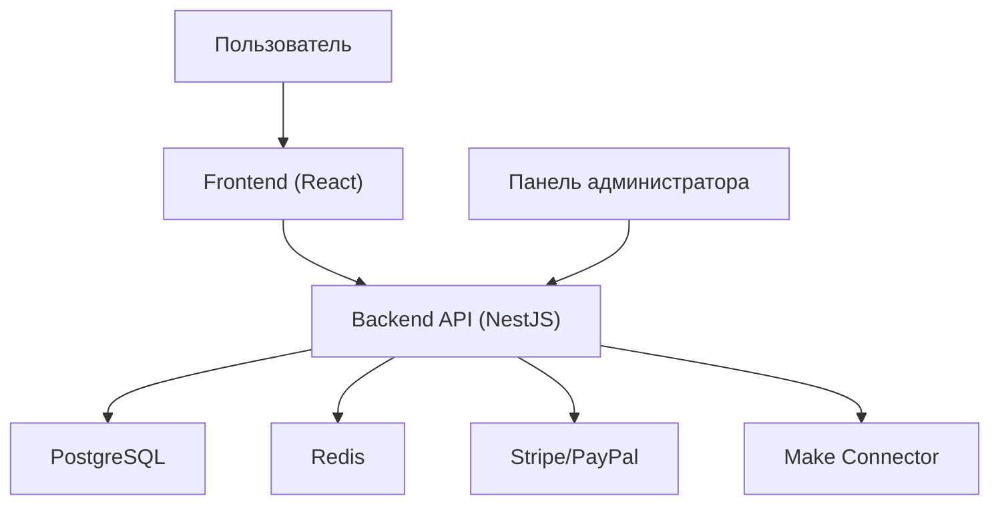

## Принципы Clean Architecture

Проект построен на принципах Clean Architecture, что обеспечивает:

1. **Независимость от фреймворков** - бизнес-логика не зависит от конкретных фреймворков и библиотек
2. **Тестируемость** - возможность тестирования бизнес-логики без внешних зависимостей
3. **Независимость от UI** - бизнес-логика не зависит от пользовательского интерфейса
4. **Независимость от базы данных** - бизнес-логика не зависит от конкретной СУБД
5. **Независимость от внешних сервисов** - бизнес-логика не зависит от внешних API и сервисов

### Слои архитектуры

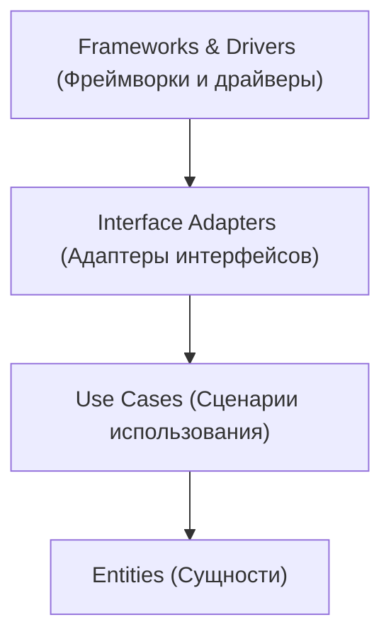

1. **Entities (Сущности)** - бизнес-объекты и правила, не зависящие от приложения
2. **Use Cases (Сценарии использования)** - бизнес-правила, специфичные для приложения
3. **Interface Adapters (Адаптеры интерфейсов)** - преобразование данных между слоями
4. **Frameworks & Drivers (Фреймворки и драйверы)** - внешние фреймворки, базы данных, UI

### Поток данных

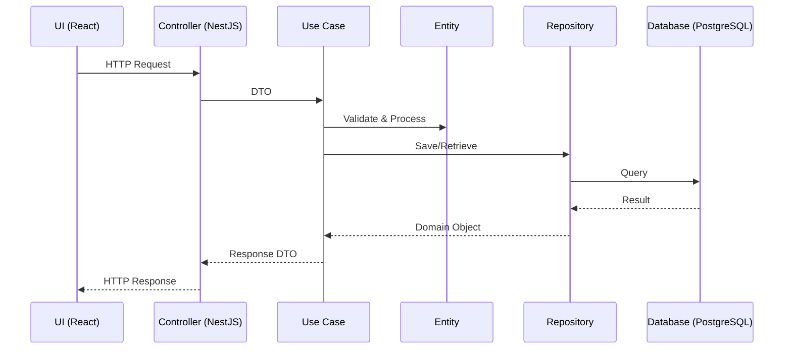

## Структура проекта

```text
integrator/
├── src/                          # Исходный код проекта
│   ├── domain/                   # Слой сущностей и бизнес-правил
│   │   ├── entities/             # Бизнес-сущности
│   │   │   ├── user.entity.ts    # Сущность пользователя
│   │   │   ├── connector.entity.ts # Сущность коннектора
│   │   │   ├── subscription.entity.ts # Сущность подписки
│   │   │   ├── payment.entity.ts # Сущность платежа
│   │   │   ├── api-key.entity.ts # Сущность API-ключа
│   │   │   └── make-account.entity.ts # Сущность аккаунта Make
│   │   │
│   │   ├── repositories/         # Интерфейсы репозиториев
│   │   │   ├── user.repository.ts # Репозиторий пользователей
│   │   │   ├── connector.repository.ts # Репозиторий коннекторов
│   │   │   ├── subscription.repository.ts # Репозиторий подписок
│   │   │   └── payment.repository.ts # Репозиторий платежей
│   │   │
│   │   └── services/             # Доменные сервисы
│   │       ├── subscription.service.ts # Сервис подписок
│   │       ├── connector.service.ts # Сервис коннекторов
│   │       └── payment.service.ts # Сервис платежей
│   │
│   ├── application/              # Слой сценариев использования
│   │   ├── use_cases/            # Сценарии использования
│   │   │   ├── user/             # Сценарии для пользователей
│   │   │   ├── subscription/     # Сценарии для подписок
│   │   │   ├── connector/        # Сценарии для коннекторов
│   │   │   └── payment/          # Сценарии для платежей
│   │   │
│   │   ├── interfaces/           # Интерфейсы для внешних сервисов
│   │   │   ├── payment-gateway.interface.ts # Интерфейс платежного шлюза
│   │   │   ├── make-api.interface.ts # Интерфейс API Make
│   │   │   └── email-service.interface.ts # Интерфейс сервиса email
│   │   │
│   │   └── dto/                  # Объекты передачи данных
│   │       ├── user.dto.ts       # DTO пользователя
│   │       ├── connector.dto.ts  # DTO коннектора
│   │       ├── subscription.dto.ts # DTO подписки
│   │       └── payment.dto.ts    # DTO платежа
│   │
│   ├── infrastructure/           # Слой инфраструктуры
│   │   ├── database/             # Реализация доступа к БД
│   │   │   ├── migrations/       # Миграции базы данных
│   │   │   ├── seeds/            # Сиды для заполнения БД
│   │   │   └── config.ts         # Конфигурация БД
│   │   │
│   │   ├── external_services/    # Интеграции с внешними сервисами
│   │   │   ├── stripe/           # Интеграция со Stripe
│   │   │   ├── make-api/         # Интеграция с API Make
│   │   │   └── sendpulse/         # Интеграция с SendPulse
│   │   │
│   │   ├── repositories/         # Реализация репозиториев
│   │   │   ├── typeorm/          # Реализации на TypeORM
│   │   │   └── mongo/            # Реализации на MongoDB
│   │   │
│   │   └── security/             # Компоненты безопасности
│   │       ├── jwt/              # JWT аутентификация
│   │       ├── oauth/            # OAuth аутентификация
│   │       └── encryption.ts     # Шифрование данных
│   │
│   ├── interfaces/               # Слой интерфейсов
│   │   ├── api/                  # REST API контроллеры
│   │   │   ├── user.controller.ts # Контроллер пользователей
│   │   │   ├── connector.controller.ts # Контроллер коннекторов
│   │   │   ├── subscription.controller.ts # Контроллер подписок
│   │   │   └── payment.controller.ts # Контроллер платежей
│   │   │
│   │   ├── web/                  # Web контроллеры
│   │   │   ├── admin.controller.ts # Контроллер админ-панели
│   │   │   └── dashboard.controller.ts # Контроллер дашборда
│   │   │
│   │   └── jobs/                 # Фоновые задачи
│   │       ├── subscription-check.job.ts # Проверка подписок
│   │       ├── payment-reminder.job.ts # Напоминания об оплате
│   │       └── usage-stats.job.ts # Сбор статистики использования
│   │
│   └── main.ts                   # Точка входа в приложение
│
├── tests/                        # Тесты
│   ├── unit/                     # Модульные тесты
│   │   ├── domain/               # Тесты для домена
│   │   ├── application/          # Тесты для приложения
│   │   └── infrastructure/       # Тесты для инфраструктуры
│   │
│   ├── integration/              # Интеграционные тесты
│   │   ├── api/                  # Тесты API
│   │   └── repositories/         # Тесты репозиториев
│   │
│   └── e2e/                      # End-to-end тесты
│       ├── user.e2e-spec.ts      # E2E тесты для пользователей
│       ├── connector.e2e-spec.ts # E2E тесты для коннекторов
│       └── subscription.e2e-spec.ts # E2E тесты для подписок
│
├── config/                       # Конфигурационные файлы
│   ├── app.config.ts             # Основная конфигурация приложения
│   ├── database.config.ts        # Конфигурация базы данных
│   ├── cache.config.ts           # Конфигурация кэширования
│   └── queue.config.ts           # Конфигурация очередей
│
├── scripts/                      # Скрипты для развертывания и т.д.
│   ├── deploy.sh                 # Скрипт деплоя
│   ├── backup.sh                 # Скрипт резервного копирования
│   └── seed-db.sh                # Скрипт заполнения БД
│
├── docs/                         # Документация проекта
│   ├── api/                      # Документация по API
│   ├── connectors/               # Документация по коннекторам
│   ├── database/                 # Схема базы данных
│   ├── development/              # Руководства по разработке
│   ├── infrastructure/           # Инфраструктура и деплой
│   ├── integrations/             # Интеграции с внешними сервисами
│   ├── marketplace/              # Документация по маркетплейсу
│   ├── monitoring/               # Мониторинг и аналитика
│   ├── overview/                 # Обзор проекта
│   ├── reference/                # Справочные материалы
│   ├── requirements/             # Требования к проекту
│   ├── security/                 # Безопасность
│   ├── subscription/             # Система подписок
│   ├── support/                  # Техническая поддержка
│   ├── testing/                  # Тестирование
│   ├── ui/                       # UI/UX документация
│   └── index.md                  # Индекс документации
│
├── .env.example                  # Пример файла с переменными окружения
├── .eslintrc.js                  # Конфигурация ESLint
├── .prettierrc                   # Конфигурация Prettier
├── docker-compose.yml            # Конфигурация Docker Compose
├── Dockerfile                    # Dockerfile для сборки образа
├── nest-cli.json                 # Конфигурация NestJS CLI
├── package.json                  # Зависимости и скрипты
├── tsconfig.json                 # Конфигурация TypeScript
└── README.md                     # Описание проекта
```

## Архитектура коннекторов

Коннекторы BPM Centr обеспечивают интеграцию между платформой Make и различными внешними сервисами. Ключевой особенностью является прямое взаимодействие данных между Make и целевыми системами без прохождения через серверы BPM Centr.

### Общая архитектура коннекторов

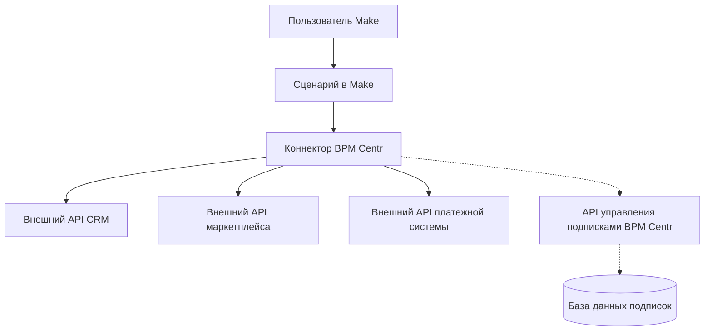

### Компоненты коннектора

1. **Метаданные** - информация о коннекторе (название, описание, версия, иконка)
2. **Конфигурация аутентификации** - параметры для аутентификации в API внешних сервисов
3. **Модули** - логические группы функциональности (например, "Контакты", "Заказы", "Платежи")
4. **Операции** - конкретные действия, которые может выполнять коннектор (например, "Получить контакт", "Создать заказ")
5. **Триггеры** - события, на которые может реагировать коннектор (например, "Новый контакт", "Изменение статуса заказа")
6. **Механизм проверки подписки** - компонент, который проверяет статус подписки пользователя через API BPM Centr

### Процесс выполнения операции коннектора

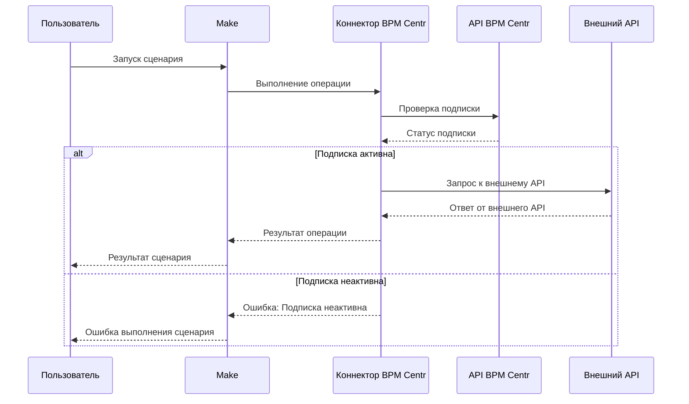

## Архитектура системы управления подписками

Система управления подписками обеспечивает контроль доступа к коннекторам на основе подписок пользователей.

### Компоненты системы управления подписками

1. **Портал управления подписками** - веб-интерфейс для регистрации, управления подписками и оплаты
2. **API управления подписками** - API для проверки статуса подписки и управления доступом
3. **Биллинговая система** - компонент для обработки платежей и управления тарифами
4. **База данных пользователей и подписок** - хранение информации о пользователях, их подписках и использовании
5. **Система аналитики** - сбор и анализ данных об использовании коннекторов

### Диаграмма системы управления подписками

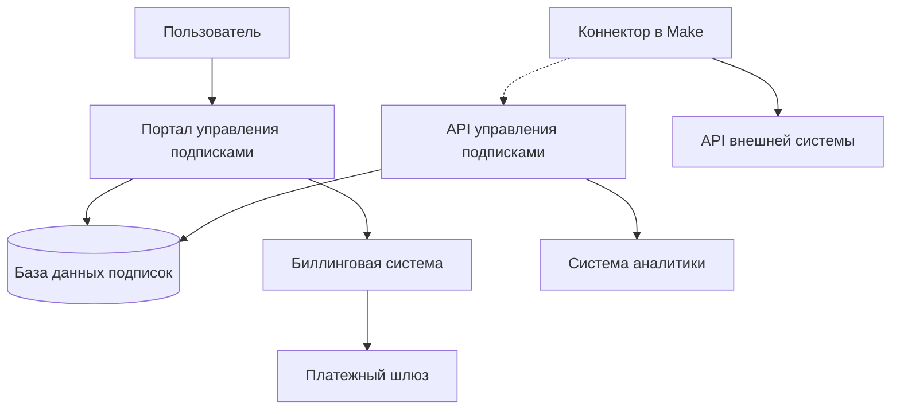

## Диаграмма потоков данных

### Регистрация и активация пользователя

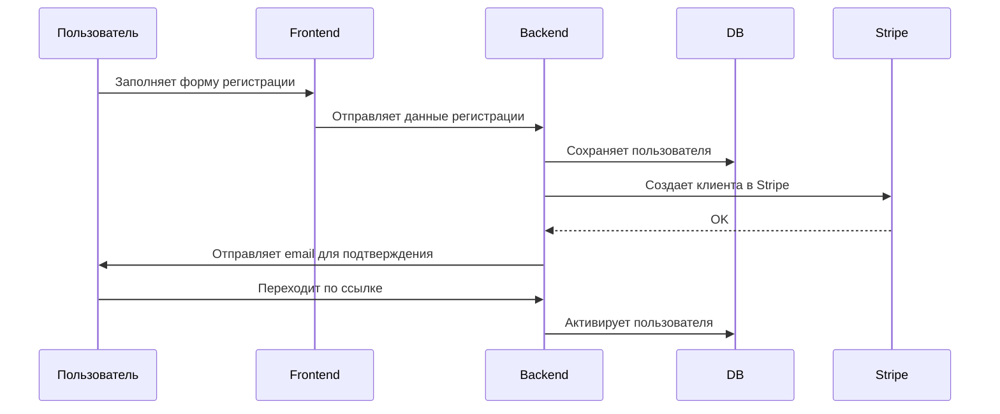

### Подписка на коннектор

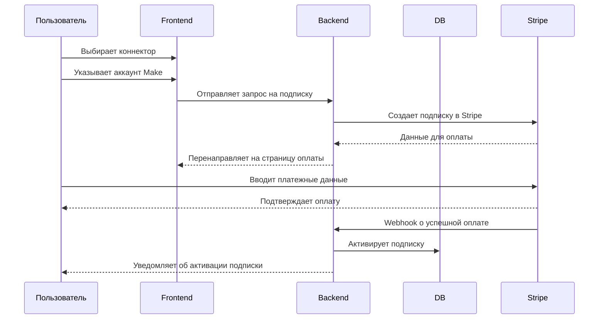

### Использование коннектора

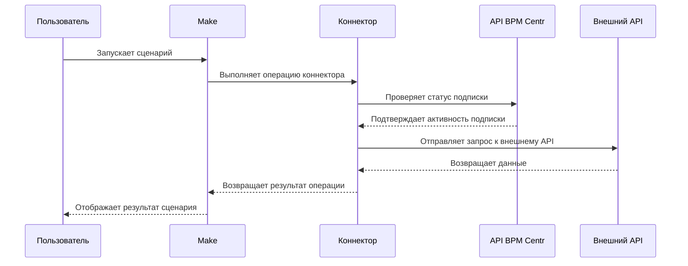

## Модели данных

### Основные сущности

1. **User** - пользователь платформы
2. **Subscription** - подписка пользователя на коннектор
3. **Connector** - коннектор с информацией о категории и стоимости
4. **Payment** - платеж за подписку
5. **ApiKey** - API-ключ для доступа к коннекторам
6. **MakeAccount** - информация об аккаунте Make
7. **ConnectorUsage** - статистика использования коннектора

### Диаграмма связей моделей данных

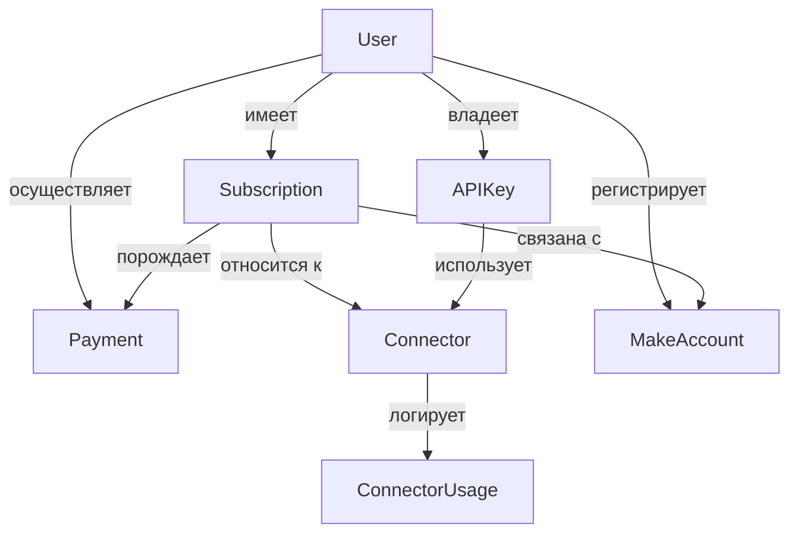

### Диаграмма состояний подписки

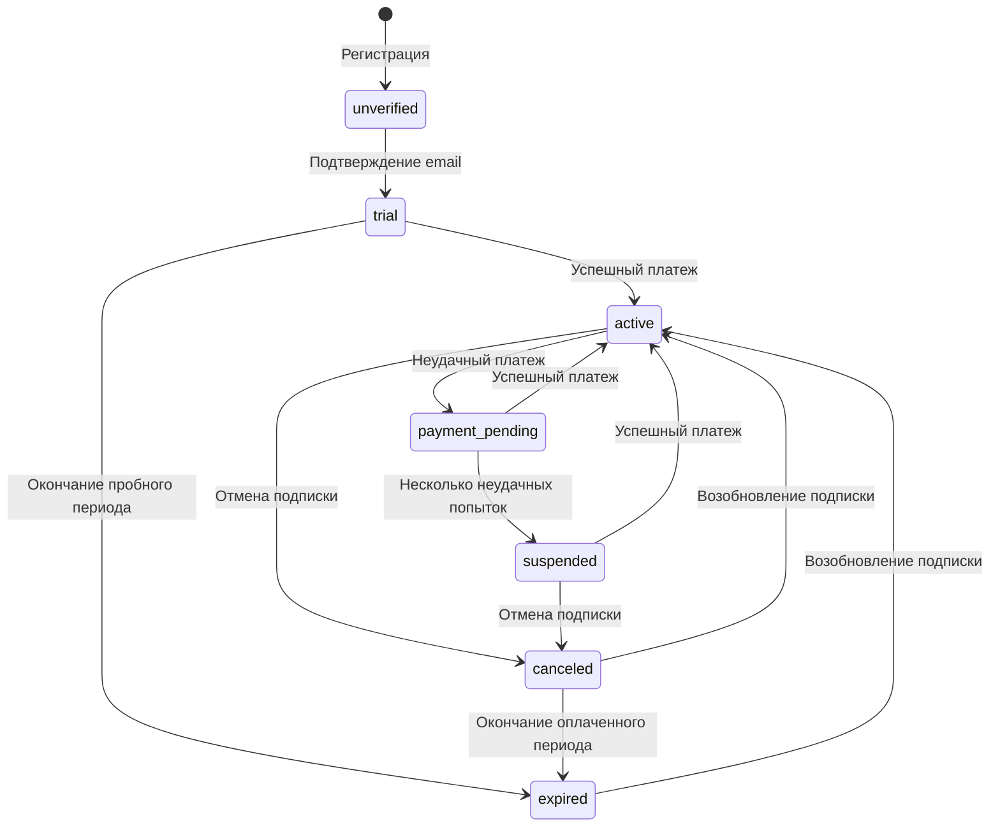

#### Описание состояний подписки

| Состояние | Описание | Доступ к API |
|------------|------------|-------------|
| unverified | Пользователь зарегистрирован, но не подтвердил email | Нет |
| trial | Активный пробный период | Да |
| active | Активная оплаченная подписка | Да |
| payment_pending | Ожидание оплаты после неудачного платежа | Да (на протяжении грейс-периода) |
| suspended | Подписка приостановлена из-за проблем с оплатой | Нет |
| canceled | Подписка отменена пользователем, но оплаченный период еще не истек | Да (до конца оплаченного периода) |
| expired | Подписка истекла | Нет |

## Технологический стек

### Backend

- **Язык программирования**: TypeScript/JavaScript
- **Фреймворк**: NestJS
- **База данных**: PostgreSQL
- **Кэширование**: Redis
- **ORM**: TypeORM
- **API**: REST, GraphQL
- **Аутентификация**: JWT, OAuth 2.0
- **Очереди**: RabbitMQ
- **Тестирование**: Jest, Supertest

### Frontend

- **Язык программирования**: TypeScript
- **Фреймворк**: React
- **Управление состоянием**: Redux, Redux Toolkit
- **Стилизация**: Styled Components, Material-UI
- **Маршрутизация**: React Router
- **Формы**: Formik, Yup
- **Тестирование**: Jest, React Testing Library

### DevOps

- **Контейнеризация**: Docker
- **Оркестрация**: Kubernetes
- **CI/CD**: GitHub Actions
- **Мониторинг**: Prometheus, Grafana
- **Логирование**: ELK Stack
- **Хранение секретов**: HashiCorp Vault

### Интеграции

- **Платежные системы**: Stripe, PayPal
- **Email**: SendPulse
- **Аналитика**: Google Analytics, Mixpanel
- **Мониторинг ошибок**: Sentry

## Связанные разделы

- [Введение в проект](introduction.md)
- [Технический стек](tech_stack.md)
- [Разработка коннекторов](../connectors/development.md)
- [Управление подписками](../subscription/overview.md)
