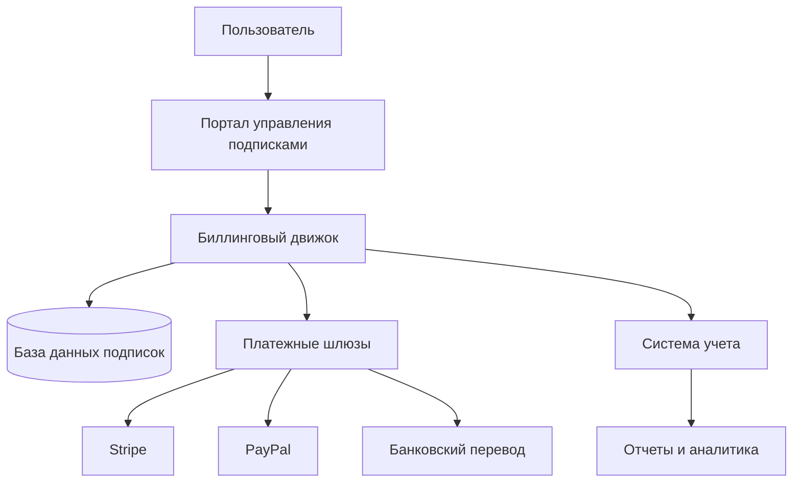

# Биллинг и оплата

В этом документе описываются процессы биллинга и оплаты в платформе "BPM Centr".

## Обзор системы биллинга

Система биллинга BPM Centr обеспечивает автоматизацию процессов выставления счетов, обработки платежей и управления подписками. Система интегрирована с платежными шлюзами и обеспечивает прозрачность финансовых операций для пользователей.

### Компоненты системы биллинга

1. **Биллинговый движок** - ядро системы, отвечающее за расчет стоимости, выставление счетов и управление подписками
2. **Платежные шлюзы** - интеграции с платежными системами для обработки платежей
3. **Система учета** - компонент для учета финансовых операций и формирования отчетности
4. **Пользовательский интерфейс** - компоненты для управления подписками и платежами в личном кабинете

### Диаграмма системы биллинга



## Модели биллинга

BPM Centr поддерживает несколько моделей биллинга для удовлетворения различных потребностей пользователей:

### Подписка на коннекторы

**Описание**: Пользователь платит фиксированную сумму за каждый коннектор на определенный период (месяц или год) и получает доступ к этому коннектору в одном аккаунте Make.

**Особенности**:
- Предсказуемые затраты для пользователя
- Простота учета и планирования
- Оплата только за необходимые коннекторы
- Отсутствие ограничений по количеству операций

**Процесс биллинга**:
1. Пользователь выбирает коннекторы и период подписки
2. Система выставляет счет на выбранные коннекторы
3. Пользователь оплачивает счет
4. Система активирует подписку на оплаченный период
5. По окончании периода система автоматически продлевает подписку и выставляет новый счет

## Периоды подписки

Для каждого коннектора доступны следующие варианты периодов подписки:

### Ежемесячная подписка

**Описание**: Пользователь платит за доступ к коннектору на 1 месяц.

**Особенности**:
- Стандартная стоимость коннектора
- Гибкость в управлении подписками
- Возможность отмены после каждого месяца


### Годовая подписка

**Описание**: Пользователь платит за доступ к коннектору на 12 месяцев.

**Особенности**:
- Скидка 15% от стоимости ежемесячной подписки
- Минимальная частота платежей
- Долгосрочное планирование

## Способы оплаты

BPM Centr использует современные платежные системы для обработки платежей:

### Банковские карты

- **Поддерживаемые карты**: Visa, MasterCard
- **Процесс оплаты**:
  1. Пользователь вводит данные карты
  2. Система проводит авторизацию карты
  3. При успешной авторизации система списывает средства
  4. Пользователь получает подтверждение оплаты
- **Безопасность**:
  - Соответствие стандарту PCI DSS
  - Шифрование данных карты
  - 3D Secure для дополнительной защиты


### Банковский перевод

- **Доступно для**: юридических лиц
- **Процесс оплаты**:
  1. Система формирует счет на оплату
  2. Пользователь скачивает счет
  3. Пользователь оплачивает счет через банк
  4. Система получает уведомление о поступлении средств
  5. Система активирует подписку
- **Особенности**:
  - Возможность оплаты по безналичному расчету
  - Необходимость подтверждения платежа
  - Задержка в активации подписки до поступления средств

### PayPal

- **Доступно для**: международных клиентов
- **Процесс оплаты**:
  1. Пользователь выбирает PayPal как способ оплаты
  2. Система перенаправляет пользователя на страницу PayPal
  3. Пользователь авторизуется и подтверждает платеж
  4. Система получает подтверждение оплаты
  5. Пользователь возвращается на сайт BPM Centr
- **Особенности**:
  - Международные платежи
  - Защита покупателя
  - Возможность оплаты в различных валютах

## Процесс выставления счетов

### Периодичность выставления счетов

Система биллинга BPM Centr работает по модели рекуррентных платежей, где дата списания привязана к дате начала подписки:

1. **Ежемесячная подписка**:
   - Счета выставляются в день очередного платежа (тот же день месяца, в который была оформлена подписка)
   - Автоматическое списание средств в день выставления счета
   - Уведомление о предстоящем списании за 3 дня

2. **Годовая подписка**:
   - Счета выставляются в день очередного платежа (тот же день и месяц, в который была оформлена подписка, но через год)
   - Автоматическое списание средств в день выставления счета
   - Уведомление о предстоящем списании за 14 дней

3. **Pay-as-you-go**:
   - Счета выставляются в конце каждого месяца
   - Автоматическое списание средств в день выставления счета
   - Уведомление о предварительной сумме за 3 дня до списания

### Содержание счета

Счет, выставляемый пользователю, содержит следующую информацию:

1. **Реквизиты компании** - юридическая информация о BPM Centr
2. **Реквизиты клиента** - информация о пользователе или организации
3. **Номер счета** - уникальный идентификатор счета
4. **Дата выставления** - дата формирования счета
5. **Период оплаты** - период, за который производится оплата
6. **Описание услуг** - перечень оплачиваемых услуг
7. **Стоимость услуг** - стоимость каждой услуги
8. **Общая сумма** - итоговая сумма к оплате
9. **Налоги** - информация о налогах (если применимо)
10. **Способ оплаты** - информация о способе оплаты
11. **Срок оплаты** - дата, до которой необходимо оплатить счет

### Автоматическое продление подписки

Система биллинга BPM Centr поддерживает автоматическое продление подписок:

1. **Процесс автоматического продления**:
   - За 3-14 дней до окончания подписки система отправляет уведомление
   - В день окончания подписки система выставляет новый счет
   - Система автоматически списывает средства с сохраненного платежного метода
   - При успешной оплате система продлевает подписку
   - Пользователь получает уведомление о продлении подписки

2. **Управление автоматическим продлением**:
   - Пользователь может включить или отключить автоматическое продление
   - При отключении автоматического продления подписка истекает в конце оплаченного периода
   - Пользователь может изменить платежный метод для автоматического продления

3. **Обработка неудачных платежей**:
   - При неудачном списании система отправляет уведомление
   - Система повторяет попытку списания через 1, 3 и 7 дней
   - После трех неудачных попыток система приостанавливает подписку
   - Пользователь может вручную оплатить счет для возобновления подписки
   - Подписка имеет грейс-период 3 дня, в течение которого доступ к коннекторам сохраняется

## Управление платежами

### Просмотр истории платежей

Пользователи могут просматривать историю платежей в личном кабинете:

1. **Список платежей**:
   - Дата платежа
   - Сумма платежа
   - Статус платежа
   - Способ оплаты
   - Период оплаты

2. **Детали платежа**:
   - Номер счета
   - Детализация услуг
   - Информация о налогах
   - Платежный метод
   - История статусов платежа

3. **Фильтрация и поиск**:
   - Фильтрация по дате
   - Фильтрация по статусу
   - Фильтрация по сумме
   - Поиск по номеру счета

### Управление платежными методами

Пользователи могут управлять своими платежными методами:

1. **Добавление платежного метода**:
   - Добавление банковской карты
   - Привязка аккаунта электронных денег
   - Настройка автоматического платежа

2. **Изменение платежного метода**:
   - Обновление данных карты
   - Изменение основного платежного метода
   - Удаление платежного метода

3. **Безопасность платежных методов**:
   - Маскирование номера карты
   - Проверка владельца карты
   - Защита данных платежных методов

### Возвраты и компенсации

Система биллинга поддерживает возвраты и компенсации:

1. **Политика возвратов**:
   - Полный возврат в течение 7 дней после первой оплаты
   - Частичный возврат за неиспользованный период при отмене годовой подписки
   - Нет возврата за текущий месяц при отмене ежемесячной подписки

2. **Процесс возврата**:
   - Пользователь запрашивает возврат через личный кабинет или поддержку
   - Система проверяет соответствие политике возвратов
   - При одобрении система инициирует возврат средств
   - Средства возвращаются на исходный платежный метод
   - Пользователь получает уведомление о возврате

3. **Компенсации**:
   - Компенсация за технические проблемы
   - Компенсация за недоступность сервиса
   - Компенсация в виде продления подписки или скидки

## Налогообложение

### Обработка налогов

Система биллинга BPM Centr обрабатывает налоги в соответствии с законодательством:

1. **НДС**:
   - Включение НДС в стоимость услуг
   - Выделение НДС в счетах
   - Формирование налоговых документов

2. **Международное налогообложение**:
   - Учет налогов в зависимости от страны пользователя
   - Соблюдение международных налоговых требований
   - Предоставление необходимой налоговой документации

3. **Налоговая отчетность**:
   - Формирование налоговой отчетности
   - Предоставление данных для налоговых органов
   - Соблюдение требований налогового законодательства

### Налоговые документы

Система формирует следующие налоговые документы:

1. **Счет-фактура**:
   - Формирование счета-фактуры для юридических лиц
   - Включение всех необходимых реквизитов
   - Соответствие требованиям законодательства

2. **Акт выполненных работ**:
   - Формирование акта выполненных работ
   - Детализация оказанных услуг
   - Подтверждение факта оказания услуг

3. **Универсальный передаточный документ (УПД)**:
   - Формирование УПД для российских юридических лиц
   - Соответствие требованиям ФНС
   - Электронный формат для электронного документооборота

## Интеграции с платежными системами

### Stripe

1. **Функциональность**:
   - Обработка платежей по банковским картам
   - Управление подписками
   - Обработка возвратов
   - Предотвращение мошенничества

2. **Процесс интеграции**:
   - Создание аккаунта в Stripe
   - Настройка webhook-уведомлений
   - Интеграция Stripe Checkout
   - Настройка обработки событий

3. **Особенности**:
   - Поддержка 3D Secure
   - Сохранение платежных методов
   - Автоматическое обновление истекших карт
   - Детальная аналитика платежей

### PayPal

1. **Функциональность**:
   - Обработка международных платежей
   - Поддержка различных валют
   - Защита покупателя
   - Управление подписками

2. **Процесс интеграции**:
   - Создание бизнес-аккаунта в PayPal
   - Настройка IPN-уведомлений
   - Интеграция PayPal Checkout
   - Настройка обработки событий

3. **Особенности**:
   - Широкое международное покрытие
   - Возможность оплаты без карты
   - Конвертация валют
   - Упрощенный процесс оплаты для пользователей PayPal

### Банковские переводы

1. **Функциональность**:
   - Обработка безналичных платежей
   - Поддержка платежей от юридических лиц
   - Формирование платежных документов
   - Учет поступлений

2. **Процесс интеграции**:
   - Настройка банковского счета
   - Интеграция с банк-клиентом
   - Настройка сверки платежей
   - Автоматизация учета поступлений

3. **Особенности**:
   - Задержка в обработке платежей
   - Необходимость ручной сверки
   - Поддержка крупных сумм
   - Соответствие требованиям для B2B-платежей

## Детальный процесс обработки платежей

### Обработка успешных платежей

При успешном платеже система выполняет следующие действия:

1. **Получение уведомления от платежного шлюза**:
   - Платежный шлюз (Stripe, PayPal) отправляет webhook о успешном платеже
   - Система проверяет подпись webhook для подтверждения подлинности
   - Система проверяет сумму платежа и валюту

2. **Обработка платежа**:
   - Система находит соответствующую подписку по идентификатору платежа
   - Система обновляет статус подписки на "active"
   - Система обновляет дату окончания подписки
   - Система создает запись о платеже в базе данных

3. **Действия после успешного платежа**:
   - Система отправляет пользователю уведомление о успешном платеже
   - Система генерирует и отправляет чек/квитанцию
   - Если это первый платеж, система генерирует API-ключ
   - Система обновляет статистику и аналитику

### Обработка неудачных платежей

При неудачном платеже система выполняет следующие действия:

1. **Получение уведомления о неудачном платеже**:
   - Платежный шлюз отправляет webhook о неудачном платеже
   - Система проверяет подпись webhook
   - Система получает информацию о причине отказа

2. **Обработка неудачного платежа**:
   - Система находит соответствующую подписку
   - Система обновляет статус подписки на "payment_pending"
   - Система создает запись о неудачном платеже в базе данных
   - Система планирует повторные попытки списания

3. **Повторные попытки списания**:
   - Система автоматически повторяет попытку списания через 1 день
   - Если попытка неудачна, система повторяет еще через 3 дня
   - Если и эта попытка неудачна, система делает последнюю попытку через 7 дней

4. **Действия после нескольких неудачных попыток**:
   - Система отправляет пользователю уведомление о неудачных попытках списания
   - Система предлагает обновить платежные данные или использовать другой способ оплаты
   - Если после трех неудачных попыток платеж не произведен, система меняет статус подписки на "suspended"
   - Подписка сохраняет грейс-период 3 дня, после чего доступ к коннекторам прекращается

## Механизм пробного периода

### Предоставление пробного периода

Платформа BPM Centr предоставляет пробный период для новых пользователей:

1. **Активация пробного периода**:
   - После регистрации и подтверждения email пользователь получает доступ к пробному периоду
   - Пробный период длится 7 дней
   - Пользователь может выбрать до 3 стандартных коннекторов для тестирования

2. **Технический процесс активации**:
   - Система создает подписку со статусом "trial"
   - Система устанавливает дату окончания пробного периода (7 дней от текущей даты)
   - Система генерирует временный API-ключ для пробного периода
   - Система активирует доступ к выбранным коннекторам

### Контроль пробного периода

Система осуществляет контроль за пробным периодом следующим образом:

1. **Отслеживание срока действия**:
   - Система ежедневно проверяет сроки действия пробных периодов
   - За 2 дня до окончания пробного периода система отправляет уведомление
   - В личном кабинете отображается оставшееся время пробного периода

2. **Завершение пробного периода**:
   - По истечении 7 дней система автоматически меняет статус подписки на "expired"
   - Временный API-ключ деактивируется
   - Доступ к коннекторам прекращается
   - Система отправляет уведомление об окончании пробного периода

## Процесс обновления подписок

### Изменение тарифов и условий

Платформа BPM Centr поддерживает процесс обновления подписок при изменении тарифов или условий:

1. **Изменение тарифов**:
   - При изменении стоимости коннекторов система уведомляет пользователей за 30 дней
   - Новые тарифы применяются только к новым подпискам или при продлении существующих
   - Текущие активные подписки сохраняют свою стоимость до окончания оплаченного периода

2. **Изменение условий подписки**:
   - При изменении условий подписки (например, функциональности коннекторов) система уведомляет пользователей
   - Изменения в функциональности коннекторов применяются ко всем подпискам
   - При существенных изменениях условий пользователям предлагается принять новые условия

### Технический процесс обновления подписок

При обновлении подписок система выполняет следующие действия:

1. **Обновление тарифов**:
   - Система создает новые тарифные планы в базе данных
   - Система обновляет информацию о тарифах в платежной системе (Stripe)
   - Система отправляет уведомления пользователям об изменении тарифов

## Обработка подписок, оформленных в разные дни месяца

Платформа BPM Centr поддерживает обработку подписок, оформленных в разные дни месяца:

1. **Принцип работы**:
   - Дата списания привязана к дате оформления подписки
   - Если подписка оформлена 15 числа, то списание будет происходить 15 числа каждого месяца
   - Система учитывает разное количество дней в месяцах

2. **Обработка крайних случаев**:
   - Если подписка оформлена 29, 30 или 31 числа, а в текущем месяце нет такого числа, списание происходит в последний день месяца
   - Например, если подписка оформлена 31 января, то в феврале списание произойдет 28 или 29 февраля
   - Система учитывает високосные годы при расчете даты списания

3. **Техническая реализация**:
   - Система использует библиотеку moment.js для корректной обработки дат
   - Для каждой подписки хранится дата начала и дата окончания
   - Система ежедневно проверяет подписки, требующие продления

## Управление API-ключами

### Автоматическая генерация API-ключей

При оформлении подписки на коннектор система автоматически генерирует API-ключ для пользователя:

1. **Процесс генерации**:
   - После успешной оплаты подписки система автоматически создает новый API-ключ
   - Ключ генерируется с использованием криптостойкого генератора случайных чисел
   - Длина ключа составляет 32 символа
   - Ключ имеет префикс, указывающий на его тип (например, `bpm_prod_` для продакшн-ключа)
   - Полный ключ показывается пользователю только один раз сразу после создания
   - В базе данных хранится только хеш ключа для обеспечения безопасности

2. **Назначение ключа**:
   - Сгенерированный API-ключ автоматически привязывается к подписке пользователя
   - Ключ предоставляет доступ ко всем коннекторам, на которые оформлена подписка
   - При первом использовании коннектора в Make ключ автоматически привязывается к аккаунту Make

3. **Уведомление пользователя**:
   - Пользователь получает уведомление о создании API-ключа по электронной почте
   - Ключ отображается в личном кабинете сразу после оплаты
   - Система предлагает скопировать ключ и сохранить его в надежном месте

4. **Технический процесс**:
   ```javascript
   // Пример процесса генерации API-ключа
   async function generateApiKey(userId, subscriptionId) {
     // Генерация случайной строки
     const randomBytes = crypto.randomBytes(24);
     const keyString = randomBytes.toString('base64').replace(/[+/=]/g, '');

     // Добавление префикса
     const apiKey = `bpm_prod_${keyString}`;

     // Создание хеша для хранения
     const keyHash = await bcrypt.hash(apiKey, 10);

     // Сохранение в базе данных
     const keyRecord = await db.apiKeys.create({
       userId,
       subscriptionId,
       name: 'Автоматически созданный ключ',
       keyHash,
       prefix: 'bpm_prod_',
       isActive: true,
       createdAt: new Date()
     });

     // Возврат полного ключа (только один раз)
     return {
       id: keyRecord.id,
       key: apiKey,
       name: keyRecord.name,
       prefix: keyRecord.prefix,
       createdAt: keyRecord.createdAt
     };
   }
   ```

### Процесс смены аккаунта Make для коннектора

Платформа BPM Centr позволяет пользователям менять привязку коннектора с одного аккаунта Make на другой:

1. **Процесс смены аккаунта**:
   - Пользователь заходит в личный кабинет BPM Centr
   - Переходит в раздел "Подписки"
   - Выбирает нужный коннектор
   - Нажимает кнопку "Сменить аккаунт Make"
   - Вводит новый идентификатор аккаунта Make
   - Подтверждает смену аккаунта

2. **Автоматическое отключение в предыдущем аккаунте**:
   - Система автоматически отключает коннектор в предыдущем аккаунте Make
   - Все сценарии в предыдущем аккаунте, использующие этот коннектор, перестают работать
   - При попытке использования коннектора в предыдущем аккаунте пользователь получит уведомление о смене привязки

3. **Технический процесс**:
   ```javascript
   // Пример процесса смены аккаунта Make
   async function changeMakeAccount(subscriptionId, newMakeAccountId) {
     // Получение текущей подписки
     const subscription = await db.subscriptions.findById(subscriptionId);

     if (!subscription) {
       throw new Error('Подписка не найдена');
     }

     // Сохранение предыдущего аккаунта
     const previousAccountId = subscription.makeAccountId;

     // Обновление привязки
     await db.subscriptions.update(subscriptionId, {
       makeAccountId: newMakeAccountId,
       previousAccountId: previousAccountId,
       accountChangedAt: new Date()
     });

     // Возврат обновленной подписки
     return {
       id: subscription.id,
       makeAccountId: newMakeAccountId,
       previousAccountId: previousAccountId,
       accountChangedAt: new Date()
     };
   }
   ```

### Управление несколькими API-ключами

Пользователи могут создавать и управлять несколькими API-ключами для разных целей:

1. **Создание дополнительных ключей**:
   - Пользователь может создать несколько API-ключей в личном кабинете
   - Каждый ключ можно назвать для удобства идентификации (например, "Продакшн", "Тестовый")
   - Каждый ключ предоставляет доступ ко всем коннекторам, на которые оформлена подписка

2. **Организация ключей**:
   - Ключи можно группировать по назначению (например, "Ключ для разработки", "Ключ для продакшна")
   - Пользователь может отслеживать использование каждого ключа
   - В интерфейсе отображается дата последнего использования ключа

3. **Управление доступом**:
   - Пользователь может деактивировать ключи, которые больше не используются
   - При компрометации ключа его можно удалить и создать новый
   - Каждый ключ имеет доступ ко всем коннекторам, на которые оформлена подписка

## Связанные разделы

- [Обзор системы подписок](overview.md)
- [Модель подписки на коннекторы](plans.md)
- [API управления подписками](api.md)
- [Управление подписками в личном кабинете](../ui_ux.md)
