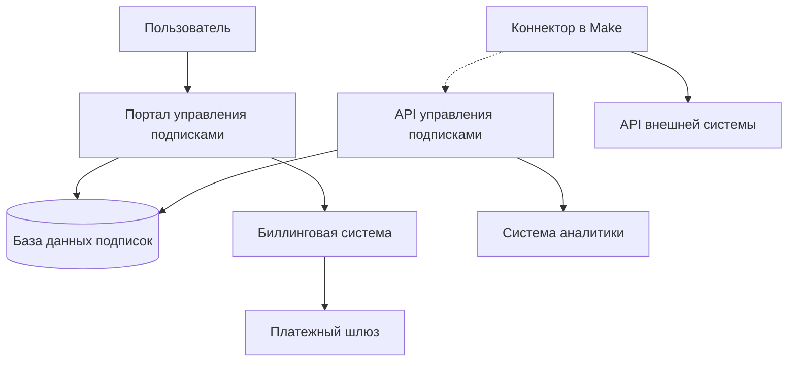

# Система управления подписками

В этом документе описывается система управления подписками для коннекторов платформы "BPM Centr".

## Обзор системы управления подписками

Система управления подписками BPM Centr обеспечивает контроль доступа к разработанным коннекторам и взимание платы за их использование. Система позволяет:

1. **Регистрировать пользователей** и управлять их учетными записями
2. **Предоставлять доступ к коннекторам** на основе оформленных подписок
3. **Контролировать использование коннекторов** через механизм проверки подписки
4. **Обрабатывать платежи** и управлять биллингом
5. **Предоставлять аналитику** по использованию коннекторов

## Архитектура системы

### Компоненты системы

1. **Портал управления подписками** - веб-интерфейс для регистрации, управления подписками и оплаты
2. **API управления подписками** - API для проверки статуса подписки и управления доступом
3. **Биллинговая система** - компонент для обработки платежей и управления тарифами
4. **База данных пользователей и подписок** - хранение информации о пользователях, их подписках и использовании
5. **Система аналитики** - сбор и анализ данных об использовании коннекторов

### Диаграмма архитектуры



## Процесс регистрации и подписки

### Регистрация пользователя

1. Пользователь регистрируется на портале BPM Centr
2. Заполняет профиль и контактную информацию
3. Подтверждает email через ссылку активации
4. Создает учетную запись

### Выбор коннекторов

1. Пользователь выбирает необходимые коннекторы из каталога
2. Знакомится с условиями и стоимостью каждого коннектора
3. Добавляет выбранные коннекторы в корзину

### Оплата подписки

1. Пользователь выбирает способ оплаты (банковская карта, электронные деньги и т.д.)
2. Вводит платежные данные
3. Подтверждает оплату
4. Получает подтверждение об успешной оплате

### Получение API-ключа

1. После успешной оплаты пользователь получает API-ключ BPM Centr
2. API-ключ используется для проверки подписки в коннекторах
3. Пользователь может управлять своими API-ключами (создавать, удалять, обновлять)

## Проверка подписки в коннекторах

### Механизм проверки подписки

Каждый коннектор BPM Centr включает механизм проверки подписки, который выполняет следующие функции:

1. **Проверка статуса подписки** - перед выполнением операций коннектор проверяет активность подписки пользователя
2. **Ограничение доступа** - если подписка неактивна или истекла, коннектор блокирует выполнение операций
3. **Учет использования** - коннектор отправляет статистику использования для аналитики (без ограничения количества операций)

### Процесс проверки подписки

1. Пользователь настраивает коннектор в Make, указывая API-ключ BPM Centr
2. При выполнении операции коннектор отправляет запрос к API управления подписками BPM Centr
3. API проверяет статус подписки пользователя, доступность коннектора и привязку к аккаунту Make
4. Если подписка активна и коннектор привязан к текущему аккаунту Make, API возвращает положительный ответ, и коннектор выполняет операцию
5. Если подписка неактивна или коннектор не привязан к текущему аккаунту Make, API возвращает отрицательный ответ, и коннектор блокирует выполнение операции

### Пример кода проверки подписки

```javascript
// Функция проверки подписки в коннекторе
async function checkSubscription(bpmCentrApiKey, connectorName, makeAccountId, context) {
  try {
    // Запрос к API BPM Centr для проверки подписки
    const response = await context.http.get({
      url: 'https://api.bpmcentr.ru/v1/subscription/check',
      headers: {
        'Authorization': `Bearer ${bpmCentrApiKey}`
      },
      params: {
        connector: connectorName,
        accountId: makeAccountId
      }
    });

    // Проверка результата
    if (response.statusCode !== 200) {
      throw new Error(`Subscription check failed: ${response.body.message || 'Unknown error'}`);
    }

    if (!response.body.active) {
      throw new Error('Your subscription is inactive or expired. Please renew your subscription at BPM Centr.');
    }

    if (!response.body.hasAccess) {
      throw new Error('This connector is not available for your subscription. Please purchase access to this connector at BPM Centr.');
    }

    if (response.body.accountId !== makeAccountId) {
      throw new Error('This connector is linked to a different Make account. Please purchase a subscription for this account at BPM Centr.');
    }

    return true;
  } catch (error) {
    throw new Error(`Subscription check failed: ${error.message}`);
  }
}

// Пример использования в операции коннектора
{
  name: 'getContact',
  execute: async function(params, context) {
    // Получение ключа BPM Centr из параметров аутентификации
    const bpmCentrApiKey = context.auth.bpmCentrApiKey;

    // Получение идентификатора аккаунта Make
    const makeAccountId = context.makeAccountId; // Получаем из контекста Make

    // Проверка подписки
    await checkSubscription(bpmCentrApiKey, 'crm-connector', makeAccountId, context);

    // Если подписка активна и привязана к текущему аккаунту, выполняем операцию
    // ...код операции...
  }
}
```

## Модель подписки

BPM Centr использует модель подписки на коннекторы, основанную на следующих принципах:

1. **Оплата за каждый коннектор** - пользователь платит фиксированную сумму за доступ к каждому коннектору
2. **Один коннектор = один аккаунт Make** - каждая подписка на коннектор привязана к одному аккаунту Make. При этом коннектор можно использовать в любом количестве сценариев внутри этого аккаунта
3. **Без ограничений по количеству операций** - подписка не ограничивает количество операций, которые можно выполнить
4. **Разные цены для разных коннекторов** - стоимость подписки зависит от сложности и уникальности коннектора

## Управление подписками

### Управление коннекторами

1. Пользователь может добавлять новые коннекторы в личном кабинете
2. При добавлении нового коннектора доступ предоставляется немедленно после оплаты
3. Пользователь может управлять периодом подписки (месяц или год)

### Отмена подписки

1. Пользователь может отменить подписку в личном кабинете
2. Доступ к коннекторам сохраняется до конца оплаченного периода
3. После окончания оплаченного периода доступ к коннекторам блокируется

### Возобновление подписки

1. Пользователь может возобновить отмененную подписку в любой момент
2. При возобновлении подписки доступ к коннекторам восстанавливается немедленно
3. Новый период подписки начинается с момента возобновления

## Связанные разделы

- [Модель подписки на коннекторы](plans.md)
- [Биллинг и оплата](billing.md)
- [API управления подписками](api.md)
- [Обзор коннекторов](../connectors/overview.md)
