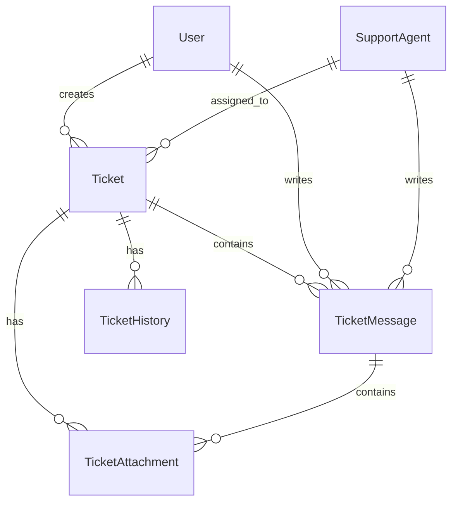

# Система тикетов для поддержки

В этом документе описывается система тикетов платформы BPM Centr, используемая для обработки обращений пользователей в техническую поддержку.

## Обзор системы тикетов

Система тикетов является основным инструментом для обработки обращений пользователей в техническую поддержку BPM Centr. Она обеспечивает структурированный подход к регистрации, отслеживанию и решению проблем пользователей.

### Цели системы тикетов

1. **Централизация обращений** - единая точка для всех обращений пользователей
2. **Структурирование информации** - стандартизированный формат для всех обращений
3. **Отслеживание прогресса** - мониторинг статуса и истории обращений
4. **Приоритизация** - распределение ресурсов в соответствии с важностью обращений
5. **Аналитика** - сбор данных для анализа и улучшения поддержки
6. **Прозрачность** - обеспечение видимости процесса для пользователей и команды поддержки

### Принципы работы системы тикетов

1. **Единый идентификатор** - каждое обращение получает уникальный номер для отслеживания
2. **Полная история** - сохранение всех взаимодействий и изменений
3. **Категоризация** - классификация обращений для эффективной обработки
4. **Эскалация** - механизм передачи сложных проблем на более высокий уровень
5. **Автоматизация** - автоматизация рутинных задач для повышения эффективности
6. **Интеграция** - связь с другими системами (база знаний, CRM, аналитика)

## Функциональность системы тикетов

### Для пользователей

1. **Создание тикетов**
   - Форма создания тикета в личном кабинете
   - Создание тикета по email
   - Преобразование чата в тикет
   - Шаблоны для типичных проблем

2. **Управление тикетами**
   - Просмотр всех своих тикетов
   - Фильтрация и сортировка тикетов
   - Обновление существующих тикетов
   - Добавление дополнительной информации
   - Прикрепление файлов и скриншотов

3. **Отслеживание статуса**
   - Просмотр текущего статуса тикета
   - История изменений статуса
   - Уведомления об обновлениях
   - Ожидаемое время решения

4. **Коммуникация**
   - Обмен сообщениями со специалистами поддержки
   - Получение уведомлений о новых сообщениях
   - Просмотр истории переписки
   - Возможность указать предпочтительный канал связи

5. **Оценка качества**
   - Оценка решения проблемы
   - Оценка работы специалиста
   - Предоставление обратной связи
   - Предложения по улучшению

### Для специалистов поддержки

1. **Управление очередью**
   - Просмотр всех активных тикетов
   - Фильтрация и сортировка по различным параметрам
   - Назначение тикетов себе или другим специалистам
   - Массовые действия с тикетами

2. **Обработка тикетов**
   - Просмотр полной информации о тикете
   - Изменение статуса, приоритета и категории
   - Добавление внутренних комментариев
   - Эскалация на более высокий уровень
   - Объединение связанных тикетов

3. **Коммуникация с пользователями**
   - Отправка ответов пользователям
   - Использование шаблонов ответов
   - Запрос дополнительной информации
   - Отправка инструкций и решений

4. **Интеграция с базой знаний**
   - Поиск в базе знаний из интерфейса тикета
   - Прикрепление статей из базы знаний к ответам
   - Создание новых статей на основе решенных тикетов
   - Анализ пробелов в базе знаний

5. **Аналитика и отчетность**
   - Просмотр личной статистики
   - Анализ эффективности работы
   - Выявление типичных проблем
   - Генерация отчетов по различным параметрам

### Для руководителей поддержки

1. **Мониторинг работы**
   - Дашборд с ключевыми показателями
   - Мониторинг нагрузки на команду
   - Отслеживание SLA и KPI
   - Выявление узких мест

2. **Управление ресурсами**
   - Распределение нагрузки между специалистами
   - Планирование расписания работы
   - Управление очередью тикетов
   - Приоритизация критических проблем

3. **Аналитика и отчетность**
   - Детальные отчеты по всем аспектам работы
   - Анализ трендов и сезонности
   - Оценка эффективности команды
   - Прогнозирование будущей нагрузки

4. **Управление процессами**
   - Настройка рабочих процессов
   - Определение правил маршрутизации
   - Настройка автоматизации
   - Управление шаблонами и категориями

## Жизненный цикл тикета

### Статусы тикетов

1. **Открыт (New)** - тикет создан, но еще не назначен специалисту
   - Триггер: создание нового тикета пользователем
   - Действия: автоматическая категоризация, определение приоритета
   - Следующие шаги: назначение специалисту

2. **Назначен (Assigned)** - тикет назначен специалисту поддержки
   - Триггер: назначение тикета специалисту
   - Действия: уведомление специалиста, обновление ожидаемого времени ответа
   - Следующие шаги: начало работы над тикетом

3. **В работе (In Progress)** - специалист активно работает над решением
   - Триггер: специалист начинает работу над тикетом
   - Действия: уведомление пользователя, обновление ожидаемого времени решения
   - Следующие шаги: решение проблемы или запрос дополнительной информации

4. **Ожидает ответа (Pending)** - ожидается дополнительная информация от пользователя
   - Триггер: запрос дополнительной информации у пользователя
   - Действия: приостановка отсчета SLA, уведомление пользователя
   - Следующие шаги: получение ответа от пользователя или автоматическое закрытие по таймауту

5. **Решен (Resolved)** - предложено решение, ожидается подтверждение от пользователя
   - Триггер: специалист предлагает решение
   - Действия: уведомление пользователя, запрос подтверждения
   - Следующие шаги: подтверждение решения пользователем или переоткрытие тикета

6. **Закрыт (Closed)** - проблема решена и подтверждена пользователем
   - Триггер: подтверждение решения пользователем или автоматическое закрытие по таймауту
   - Действия: отправка опроса удовлетворенности, обновление базы знаний
   - Следующие шаги: возможное переоткрытие, если проблема возникнет снова

7. **Переоткрыт (Reopened)** - проблема возникла повторно или решение не удовлетворило пользователя
   - Триггер: пользователь сообщает о повторном возникновении проблемы
   - Действия: возобновление работы над тикетом, возможная эскалация
   - Следующие шаги: повторное решение проблемы

### Приоритеты тикетов

1. **Критический (Critical)** - система полностью недоступна или критическая функциональность не работает
   - Примеры: недоступность платформы, невозможность авторизации, потеря данных
   - SLA: первый ответ в течение 1 часа, решение в течение 4 часов
   - Особенности: немедленное уведомление руководителя поддержки, возможность эскалации

2. **Высокий (High)** - серьезная проблема, влияющая на основные бизнес-процессы
   - Примеры: неработоспособность ключевого коннектора, проблемы с оплатой
   - SLA: первый ответ в течение 4 часов, решение в течение 8 часов
   - Особенности: приоритетная обработка, регулярные обновления статуса

3. **Средний (Medium)** - проблема, влияющая на некритичные функции
   - Примеры: ошибки в отдельных операциях, проблемы с интерфейсом
   - SLA: первый ответ в течение 8 часов, решение в течение 24 часов
   - Особенности: стандартная обработка

4. **Низкий (Low)** - незначительная проблема или запрос на информацию
   - Примеры: вопросы по использованию, запросы на улучшение, косметические проблемы
   - SLA: первый ответ в течение 24 часов, решение в течение 48 часов
   - Особенности: обработка при наличии свободных ресурсов

### Категории тикетов

1. **Технические проблемы**
   - Ошибки в работе коннекторов
   - Проблемы с API
   - Проблемы с интеграцией
   - Ошибки в интерфейсе
   - Проблемы с производительностью

2. **Вопросы по использованию**
   - Настройка коннекторов
   - Создание сценариев
   - Функциональные возможности
   - Лучшие практики
   - Ограничения и совместимость

3. **Вопросы по аккаунту**
   - Регистрация и доступ
   - Управление подписками
   - Платежи и биллинг
   - Управление пользователями
   - Безопасность и конфиденциальность

4. **Запросы на улучшение**
   - Предложения новых функций
   - Запросы на новые коннекторы
   - Улучшение существующих функций
   - Улучшение документации
   - Улучшение интерфейса

5. **Другое**
   - Общие вопросы
   - Партнерство и сотрудничество
   - Отзывы и предложения
   - Запросы на обучение
   - Вопросы, не относящиеся к другим категориям

### Процесс обработки тикета

1. **Создание тикета**
   - Пользователь создает тикет через личный кабинет, email или чат
   - Система автоматически присваивает уникальный номер
   - Пользователь получает уведомление о создании тикета
   - Тикет попадает в очередь необработанных

2. **Первичная обработка**
   - Система автоматически категоризирует тикет на основе ключевых слов
   - Система определяет начальный приоритет на основе категории и содержания
   - Тикет назначается специалисту поддержки в соответствии с правилами маршрутизации
   - Специалист получает уведомление о новом тикете

3. **Анализ и решение**
   - Специалист анализирует проблему и ищет решение
   - При необходимости запрашивает дополнительную информацию у пользователя
   - Использует базу знаний и внутренние ресурсы для поиска решения
   - При необходимости эскалирует проблему на более высокий уровень
   - Предлагает решение пользователю

4. **Подтверждение и закрытие**
   - Пользователь проверяет предложенное решение
   - Подтверждает решение проблемы или сообщает о продолжении проблемы
   - При подтверждении тикет закрывается
   - Пользователю предлагается оценить качество поддержки
   - Информация о решении может быть добавлена в базу знаний

5. **Последующий анализ**
   - Анализ эффективности решения
   - Выявление типичных проблем и их причин
   - Разработка превентивных мер
   - Обновление базы знаний и документации
   - Улучшение процессов поддержки

## Технологическая реализация

### Архитектура системы тикетов

Система тикетов BPM Centr построена на основе современной архитектуры с использованием следующих компонентов:

1. **Фронтенд**
   - Интерфейс пользователя в личном кабинете
   - Интерфейс специалиста поддержки
   - Интерфейс руководителя поддержки
   - Адаптивный дизайн для различных устройств

2. **Бэкенд**
   - API для взаимодействия с фронтендом
   - Бизнес-логика обработки тикетов
   - Система уведомлений
   - Система автоматизации и правил

3. **База данных**
   - Хранение тикетов и связанной информации
   - Хранение истории изменений
   - Хранение метаданных для аналитики
   - Резервное копирование и архивирование

4. **Интеграции**
   - Интеграция с email-системой
   - Интеграция с базой знаний
   - Интеграция с системой уведомлений
   - Интеграция с аналитическими инструментами

### Модель данных

#### Основные сущности

1. **Ticket (Тикет)**
   - id: уникальный идентификатор
   - number: номер тикета (для отображения пользователям)
   - subject: тема тикета
   - description: описание проблемы
   - status: текущий статус
   - priority: приоритет
   - category: категория
   - created_at: дата и время создания
   - updated_at: дата и время последнего обновления
   - resolved_at: дата и время решения
   - closed_at: дата и время закрытия
   - sla_first_response_due: крайний срок первого ответа по SLA
   - sla_resolution_due: крайний срок решения по SLA
   - user_id: идентификатор пользователя, создавшего тикет
   - assignee_id: идентификатор специалиста, назначенного на тикет
   - source: источник тикета (web, email, chat)

2. **TicketMessage (Сообщение в тикете)**
   - id: уникальный идентификатор
   - ticket_id: идентификатор тикета
   - body: текст сообщения
   - created_at: дата и время создания
   - author_id: идентификатор автора
   - author_type: тип автора (user, support, system)
   - is_internal: флаг внутреннего комментария (видимого только для поддержки)
   - attachments: прикрепленные файлы

3. **TicketHistory (История тикета)**
   - id: уникальный идентификатор
   - ticket_id: идентификатор тикета
   - field: измененное поле
   - old_value: старое значение
   - new_value: новое значение
   - created_at: дата и время изменения
   - user_id: идентификатор пользователя, внесшего изменение

4. **TicketAttachment (Вложение к тикету)**
   - id: уникальный идентификатор
   - ticket_id: идентификатор тикета
   - message_id: идентификатор сообщения (если прикреплено к сообщению)
   - filename: имя файла
   - file_size: размер файла
   - content_type: тип содержимого
   - url: ссылка на файл
   - created_at: дата и время загрузки

#### Связи между сущностями

### API для интеграции

Система тикетов предоставляет API для интеграции с другими системами:

1. **Публичное API для пользователей**
   - Создание тикетов
   - Получение списка своих тикетов
   - Получение деталей тикета
   - Добавление сообщений
   - Прикрепление файлов
   - Закрытие тикета

2. **Внутреннее API для интеграций**
   - Создание тикетов от имени других систем
   - Обновление статуса тикетов
   - Получение статистики и аналитики
   - Управление правилами и автоматизацией
   - Интеграция с системой уведомлений

### Автоматизация и правила

Система тикетов включает механизмы автоматизации для повышения эффективности:

1. **Автоматическая категоризация**
   - Анализ содержания тикета
   - Определение категории на основе ключевых слов
   - Машинное обучение для улучшения точности
   - Возможность ручной корректировки

2. **Автоматическая маршрутизация**
   - Назначение тикетов специалистам на основе категории
   - Балансировка нагрузки между специалистами
   - Учет компетенций специалистов
   - Учет рабочего времени и доступности

3. **Автоматические ответы**
   - Подтверждение получения тикета
   - Предложение решений из базы знаний
   - Запрос дополнительной информации
   - Уведомления о статусе и обновлениях

4. **Правила эскалации**
   - Автоматическая эскалация при нарушении SLA
   - Эскалация при определенных ключевых словах
   - Эскалация при повторном открытии тикета
   - Уведомления руководителей при эскалации

## Метрики и аналитика

### Ключевые показатели эффективности (KPI)

1. **Время отклика**
   - Среднее время первого ответа
   - Процент ответов в рамках SLA
   - Распределение времени ответа по категориям
   - Тренды изменения времени ответа

2. **Время решения**
   - Среднее время решения тикета
   - Процент решений в рамках SLA
   - Распределение времени решения по категориям
   - Тренды изменения времени решения

3. **Объем тикетов**
   - Общее количество тикетов
   - Распределение по категориям
   - Распределение по приоритетам
   - Тренды изменения объема

4. **Качество поддержки**
   - Средняя оценка удовлетворенности
   - Процент решенных с первого раза
   - Процент переоткрытых тикетов
   - Количество эскалаций

5. **Эффективность специалистов**
   - Количество обработанных тикетов
   - Среднее время решения
   - Оценки удовлетворенности
   - Соблюдение SLA

### Отчетность и анализ

1. **Оперативные отчеты**
   - Текущая нагрузка и распределение тикетов
   - Тикеты с нарушением SLA
   - Тикеты, требующие внимания
   - Производительность специалистов

2. **Тактические отчеты**
   - Еженедельные и ежемесячные тренды
   - Анализ категорий и приоритетов
   - Анализ времени ответа и решения
   - Анализ удовлетворенности пользователей

3. **Стратегические отчеты**
   - Долгосрочные тренды и сезонность
   - Анализ корневых причин проблем
   - Оценка эффективности процессов
   - Планирование ресурсов и улучшений

### Использование аналитики

1. **Улучшение процессов**
   - Выявление узких мест
   - Оптимизация маршрутизации
   - Улучшение автоматизации
   - Совершенствование SLA

2. **Развитие базы знаний**
   - Выявление часто задаваемых вопросов
   - Определение пробелов в документации
   - Создание новых статей на основе решений
   - Улучшение существующего контента

3. **Планирование ресурсов**
   - Прогнозирование нагрузки
   - Определение потребности в специалистах
   - Планирование обучения
   - Оптимизация рабочего времени

4. **Улучшение продукта**
   - Выявление проблемных областей
   - Определение приоритетов разработки
   - Оценка влияния изменений
   - Предотвращение повторяющихся проблем

## Интеграция с другими системами

### Интеграция с базой знаний

1. **Поиск решений**
   - Поиск в базе знаний при создании тикета
   - Предложение релевантных статей
   - Автоматическое связывание тикетов со статьями
   - Отслеживание эффективности предложенных решений

2. **Обновление базы знаний**
   - Создание новых статей на основе решенных тикетов
   - Обновление существующих статей
   - Выявление пробелов в базе знаний
   - Анализ использования статей

### Интеграция с системой уведомлений

1. **Уведомления для пользователей**
   - Создание и обновление тикетов
   - Новые сообщения от поддержки
   - Изменение статуса тикета
   - Запросы дополнительной информации

2. **Уведомления для специалистов**
   - Новые назначенные тикеты
   - Ответы от пользователей
   - Нарушение SLA
   - Эскалации и приоритетные тикеты

3. **Каналы уведомлений**
   - Email-уведомления
   - Push-уведомления в браузере
   - Мобильные push-уведомления
   - SMS-уведомления (для критических случаев)

### Интеграция с CRM-системой

1. **Синхронизация данных о пользователях**
   - Профили пользователей
   - История взаимодействия
   - Подписки и платежи
   - Предпочтения и настройки

2. **Обогащение данных о тикетах**
   - Связь с компанией и контактами
   - История предыдущих обращений
   - Информация о продуктах и услугах
   - Статус и ценность клиента

### Интеграция с системой аналитики

1. **Передача данных для анализа**
   - Метрики производительности
   - Данные о пользовательском опыте
   - Информация о проблемах и решениях
   - Обратная связь и оценки

2. **Получение аналитических данных**
   - Прогнозы нагрузки
   - Сегментация пользователей
   - Анализ поведения пользователей
   - Выявление трендов и паттернов

## Безопасность и конфиденциальность

### Защита данных

1. **Шифрование данных**
   - Шифрование данных в покое
   - Шифрование данных при передаче
   - Безопасное хранение вложений
   - Защита персональных данных

2. **Контроль доступа**
   - Ролевая модель доступа
   - Многофакторная аутентификация
   - Аудит действий пользователей
   - Ограничение доступа по IP

3. **Соответствие требованиям**
   - Соответствие GDPR
   - Соответствие локальным законам о защите данных
   - Политики хранения и удаления данных
   - Процедуры обработки запросов на доступ к данным

### Конфиденциальность

1. **Политика конфиденциальности**
   - Четкое определение обрабатываемых данных
   - Цели обработки данных
   - Сроки хранения данных
   - Права пользователей

2. **Обработка чувствительной информации**
   - Маскирование чувствительных данных
   - Ограничение доступа к чувствительной информации
   - Автоматическое обнаружение и защита чувствительных данных
   - Процедуры безопасного удаления

## Обучение и документация

### Для пользователей

1. **Руководство по использованию**
   - Создание и управление тикетами
   - Эффективная коммуникация с поддержкой
   - Использование базы знаний
   - Часто задаваемые вопросы

2. **Обучающие материалы**
   - Видеоинструкции
   - Пошаговые руководства
   - Интерактивные подсказки
   - Примеры эффективных обращений

### Для специалистов поддержки

1. **Руководство по работе с системой**
   - Обработка тикетов
   - Эффективная коммуникация
   - Использование базы знаний
   - Эскалация и приоритизация

2. **Обучение и развитие**
   - Начальное обучение
   - Регулярные тренинги
   - Обмен опытом и лучшими практиками
   - Сертификация специалистов

### Для руководителей

1. **Руководство по управлению**
   - Мониторинг и аналитика
   - Управление командой
   - Оптимизация процессов
   - Планирование ресурсов

2. **Стратегическое развитие**
   - Определение и измерение KPI
   - Улучшение качества поддержки
   - Интеграция с другими процессами
   - Планирование улучшений

## Связанные разделы

- [Обзор технической поддержки](support_overview.md)
- [База знаний](knowledge_base.md)
- [Обучение и онбординг](training.md)
- [Политика безопасности данных](../security/security_policy.md)
- [Интеграция с Make](../integrations/make_integration.md)
